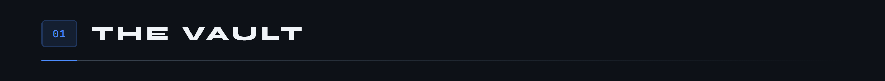
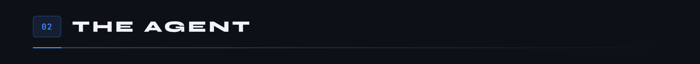
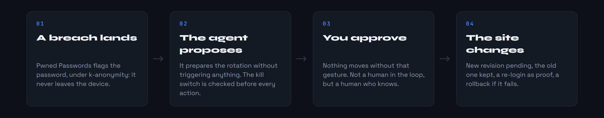
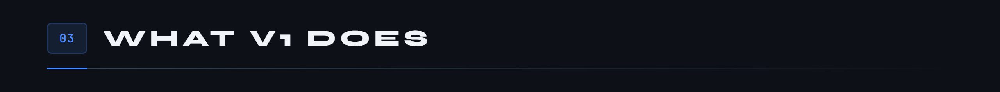
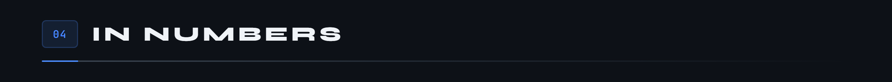
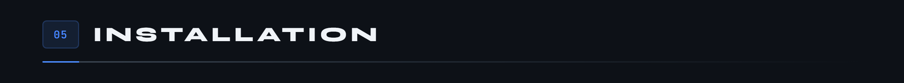
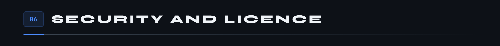

<div align="center">

<p>
  <a href="README.md"></a>
  
</p>


[](https://github.com/Cybertrist/Serenity/actions/workflows/ci.yml)

</div>

A **complete, self-hosted** password manager, with its own encrypted vault. No Bitwarden or Vaultwarden underneath: the vault, the API and the clients are written here.

What sets it apart: an **agent** that watches for data breaches and takes care of the passwords you hand over to it. The principle fits in one sentence: not a human in the loop, but a human always kept informed.




The vault has two zones, and that design choice drives everything else.


<div align="center">


</div>

> The screenshots show the interface in French, the only language it ships in.

Under the hood, a single cryptography library, libsodium, and no hand-written primitives. The master password goes through Argon2id to give the master key, which never leaves the device. Entries are encrypted with XChaCha20-Poly1305, with the entry identifier, its zone and its revision as associated data: two encrypted blocks can be neither swapped nor replayed. The full specification lives in [`docs/crypto.md`](docs/crypto.md), in French.





The proof is asked of the site itself: the old password is refused, the new one opens the door. Nothing is replayed or staged, and `make film` records it against the demo site.

<div align="center">


</div>




A kill switch stops the agent immediately, and it is checked before every action, not only at launch.

Next comes the native Android app with notifications in V2, then rotation on real sites in V3, with one recipe per site and a browser extension.

<div align="center">


</div>



As of 20 September 2026, ahead of `v0.1.0`.




```bash
git clone git@github.com:Cybertrist/Serenity.git
cd Serenity
cp .env.example .env   # then fill in the values
make init
make up
```

**Nothing is exposed outside `127.0.0.1`.** Serenity never puts itself on the Internet: you reach it from your devices through the private path of your choice, a mesh network, a VPN, an SSH tunnel or a reverse proxy on your local network. The [infrastructure page](docs/02-infrastructure.md), in French, compares the four.

All the documentation is in [`docs/`](docs/README.md), in French, one page per phase.



> Serenity has not been audited yet. Do not put real accounts in it before version 0.1.0 and an external audit.

The non-negotiable rules are in [`CLAUDE.md`](CLAUDE.md). To report a vulnerability, go through [`SECURITY.md`](SECURITY.md), never a public issue.

The scope is kept deliberately narrow, so open an issue before writing code. [`CONTRIBUTING.md`](CONTRIBUTING.md) explains how to run the project, what to check before a pull request, and the rules that are not up for discussion.

Licensed under [GNU AGPL v3](LICENSE) or later, copyright (C) 2026 Tristan. That is the usual choice for a self-hosted server, the one the Bitwarden server made among others: anyone running a modified Serenity for other people has to publish the code. Serenity comes with no warranty whatsoever.
