<div align="center">

<p>
  <a href="README.md"></a>
  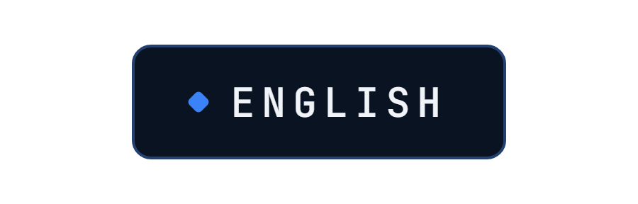
</p>

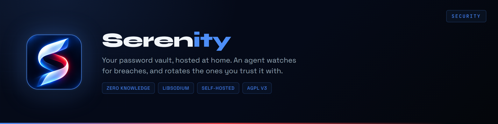

[](https://github.com/Cybertrist/Serenity/actions/workflows/ci.yml)

</div>

A complete password manager you host yourself, with its own encrypted vault, and an agent that keeps watch while you sleep.

I wanted my passwords at home, on my own machine, not with a service that holds millions of them. Self-hosted vaults exist, but none did what I was really missing: tell me when an account leaked, and change the password for me when I ask it to. That is where Serenity comes from. The vault, the API and the clients are written here, with no Bitwarden or Vaultwarden underneath, one cryptography library, libsodium, and no home-made primitive.

Everything rests on a vault with two zones. What really matters, the bank or the main mailbox, stays in your zone: encrypted on your device, unreadable to the server. What you hand to the agent, one entry at a time, it can read, watch and change. The principle fits in a sentence: not a human in the loop, but a human always kept informed. And a kill switch stops it dead, checked before every action.

The interface and the documentation are in French; the diagrams below exist in both languages.

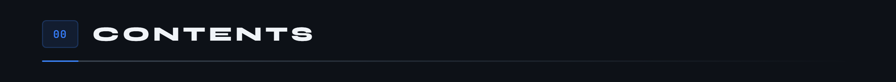

<p align="center">
<a href="#features"></a>
<a href="#screens">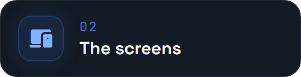</a>
<a href="#install">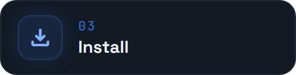</a>
<br>
<a href="#zones">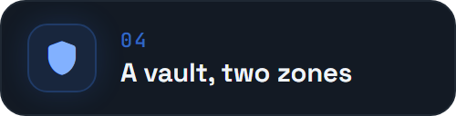</a>
<a href="#cryptography">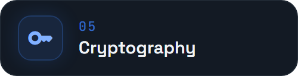</a>
<a href="#sign-in">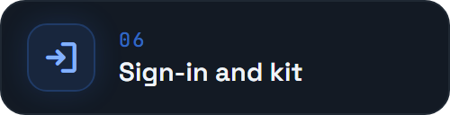</a>
<br>
<a href="#watch"></a>
<a href="#agent"></a>
<a href="#rotation">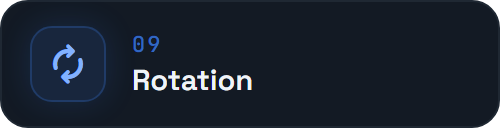</a>
<br>
<a href="#guardrails">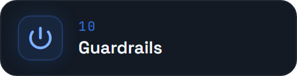</a>
<a href="#codes">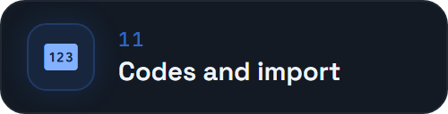</a>
<a href="#backups">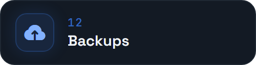</a>
<br>
<a href="#architecture"></a>
<a href="#tests">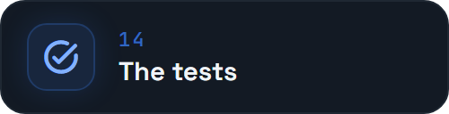</a>
<a href="#versions">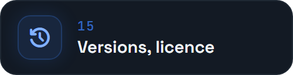</a>
</p>

<a id="features"></a>
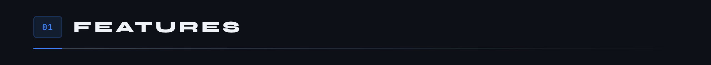

Here is Serenity in eleven gestures, from unlocking to locking. On the left, the app replays its real screens; on the right, you see what happens behind them: the key drawn from your password, the five characters sent to Pwned Passwords, the rotation the agent proposes before it touches anything. Each gesture has its own diagram further down.


<a id="screens"></a>
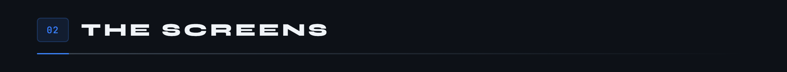

Here is Serenity on a phone, one screen at a time, as it really looks (in French). Everything you see is decrypted and computed on the device: the server only gets blocks it cannot open, except the ones you hand to the agent.


On a computer, Serenity runs in your browser or in its desktop app for Windows and Linux. It is the same client either way. The sidebar, the palette (Ctrl K) and the status bar take the place of the phone's tabs, and the light behind the vault tells you how things stand: blue when all is well, amber when an account leaked, violet while the agent works, grey when it is stopped.


It is one web client with three forms. Under 900 px, you get five tabs at the bottom, under your thumb. Above that, a sidebar and the palette. In the desktop app, the window draws its own title bar and locks with your session. It ships no vault code at all: it shows the page your server sends, with the same CSP and the same keys held in memory only.


<a id="install"></a>
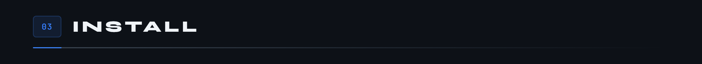

You need a VM with Docker, four commands, and a private path to it. Serenity only listens on `127.0.0.1` and never goes on the Internet: you reach it from your devices through the private access of your choice, a mesh network, a VPN, an SSH tunnel or a reverse proxy on your local network. At home, that is `tailscale serve`. The [infrastructure page](docs/02-infrastructure.md) (in French) compares the four.

```bash
git clone https://github.com/Cybertrist/Serenity.git
cd Serenity
cp .env.example .env   # then fill in the values
make init
make up
```

On your computer, take the desktop app. On first launch it asks for your server's address, `https` only, then opens straight onto your vault. Both buttons lead to the latest Release; the first one comes with `v0.1.0`, and until then `make desktop-dist` builds the installer for your platform.

<p align="center">
  <a href="https://github.com/Cybertrist/Serenity/releases/latest">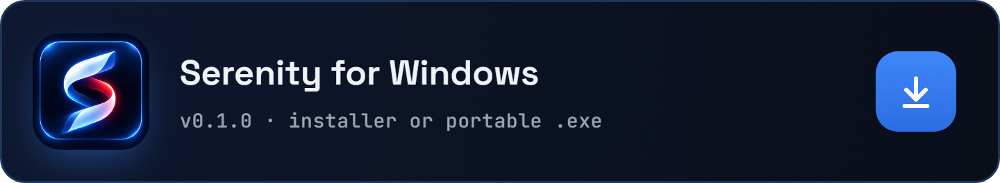</a>
  <a href="https://github.com/Cybertrist/Serenity/releases/latest">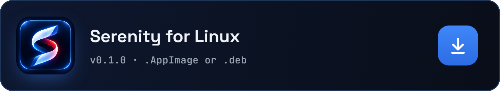</a>
</p>

The installers are not signed yet: Windows SmartScreen will show a warning on first launch. On your phone, open your server's address in the browser, then "Install app": it is a PWA, which also works offline, read only.


All the documentation lives in [`docs/`](docs/README.md), in French, one page per phase.

<a id="zones"></a>
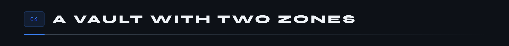

The vault has two zones, and that choice drives everything else. A new entry always lands in your zone, encrypted with a key that never leaves your devices. Handing it to the agent is a gesture, made one entry at a time, with a confirmation that says what the server will be able to do. Your device then decrypts it, encrypts it again with the agent key, and the server refuses the change of zone without `confirm: true`.


<a id="cryptography"></a>
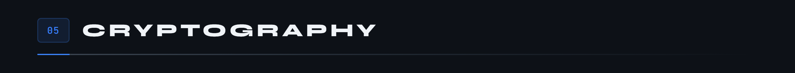

Everything starts from your master password, and it never leaves your device. Argon2id turns it into a master key that only lives long enough to give two subkeys: one opens your user key, the other is the only one sent to the server, which keeps nothing but a hash of it. Your user key opens the agent key, and your recovery kit is a second door to it. The server only ever sees encrypted blocks.


Each entry is an XChaCha20-Poly1305 block bound to its context: your account, the entry's identifier, its zone and its revision. That context isn't stored, your device rebuilds it. If the server swaps two blocks, serves an old version again or moves an entry to another zone, decryption simply refuses. Python and TypeScript check the same test vectors, including the ones that must fail.


The full specification lives in [`docs/crypto.md`](docs/crypto.md), in French: the primitives, the key hierarchy, the formats byte by byte, every flow and the threat model.

<a id="sign-in"></a>
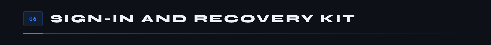

Creating your account takes three screens. Your device draws your keys at random and encrypts them before anything leaves: the server only gets two authentication keys, which it hashes, and blocks it can't open. Your first six-digit code activates the account and closes sign-ups. Your recovery kit shows up only once: write it down.


You're asked for the six-digit code only on a new device, then every 60 days. Day to day, your master password is enough: the vault stays open for 15 minutes, extended with each action, and your keys live only in memory. Without a network, you can still read it. If you forget your password, your kit and a code let you pick a new one, and you leave with a fresh kit.


<a id="watch"></a>
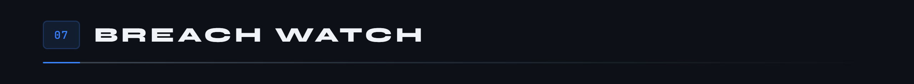

To find out whether a password leaked, your device hashes it and sends only the first five characters. Pwned Passwords sends back a few hundred suffixes that start the same, padded, and the comparison happens on your side. Your server only gets the result: which entry, which kind of alert. Never a password, nor a site name.


The local checks cost nothing, so they run over the whole vault every time you open the tab. The question to Pwned Passwords weighs 100 kB per entry, so the server keeps the calendar: it only asks again for a new entry, a changed password, or a check older than 24 hours. Open the tab ten times, nothing goes out.


<a id="agent"></a>
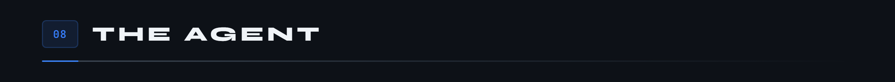

A breach on an account handed to the agent does not wait: right after the report, the server checks the kill switch and prepares the rotation. You get a notification, which carries no name (your app writes it), you see the four steps, and you approve or refuse. Your personal entries are never touched: the agent warns you, that's all.


<a id="rotation"></a>
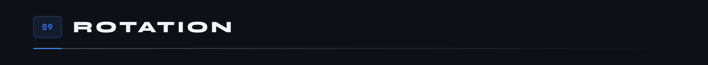

When you approve, the agent doesn't touch the site right away. It first stores the new password in your vault as a pending revision, while the active entry keeps the old one. The rotator, the only container with a browser, signs in, changes it, then signs in again from scratch. Only that proof makes the new revision the real one.


A site can refuse, stop answering, or keep who knows which password. In every case your vault keeps the one that opens the site: a rollback if the old one still works, a question to the site if the answer got lost. And when nothing is certain, the agent doesn't guess: your entry shows both passwords, and you say which one works.


The agent only changes sites that have a recipe, a small JSON file that says where the fields are and what proves a step worked. For now only one has one: the demo site in the repository, on which CI replays the rotation at every commit. `make film` records it end to end, faking nothing but the pace:

<div align="center">


</div>

<a id="guardrails"></a>
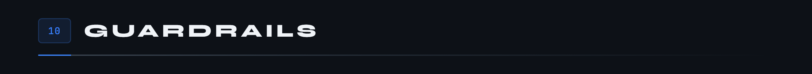

Before every action, code decides, never a language model: kill switch, agent zone, daily cap, allowlist, then a line in the log. You hold the kill switch for a second. Let go too early and it springs back; hold it to the end and the agent stops dead while the interface turns grey. Some things stay out of reach for good: no code by mail or text message, no "forgot password", no CAPTCHA.


<a id="codes"></a>
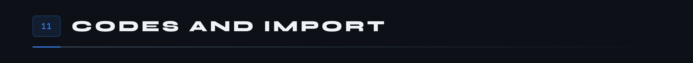

Two-factor codes are computed on your device, from the secret kept in the entry: nothing is asked of the server, and the screen works offline. One touch copies a code, and Serenity empties the clipboard 30 seconds later. The one deliberate exception is an entry handed to the agent: the server can compute its code too, so it can sign back in during a rotation.


You can bring in your passwords from Google or Bitwarden, and your codes from Google Authenticator. The file is read and encrypted on your device: the server only gets blocks it cannot open, and everything lands in your zone. The format is told by the content, not the file name, and an imported code never replaces an entry's own: it joins the entry if it has none, otherwise it becomes an entry of its own.


<a id="backups"></a>
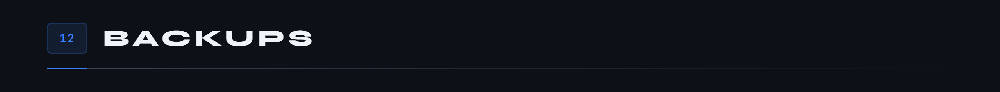

Every night at 03:12, Serenity backs up what cannot be rebuilt: the database, copied by SQLite itself, and the two server keys, in an encrypted restic snapshot. Without the server key the agent zone would never open again, so it goes along. The repository password stays on paper, never in Serenity. And since an untested backup proves nothing, `make backup-check` destroys a test vault and restores it, in CI, on every push.


<a id="architecture"></a>


Serenity runs on a Debian VM, in four Docker containers, and only one port is published, on `127.0.0.1`. Your phone reaches it through a private HTTPS path, and only sends blocks that are already encrypted. Only the agent and the rotator may reach the Internet: one to ask Pwned Passwords, the other to open the site whose password it changes.


Here is what an attacker reads, depending on what they get. A backup without its password, or the network, gives them nothing; the database alone gives them the metadata; the database and the server key open the agent zone. The hard point is owned: whoever takes the VM takes the agent zone. Your personal zone only opens in a browser you unlocked yourself.


<a id="tests"></a>
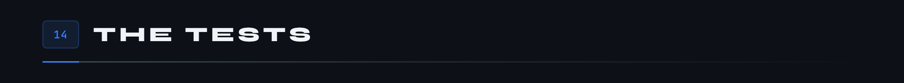

Every push replays everything, in eight jobs. pytest passes 208 cases on the server side and vitest 87 on the client. A block encrypted by Python must open in TypeScript, and the other way round. Fifteen journeys play the client against the real server, Chromium walks every screen under a strict CSP, and a throwaway vault is really destroyed, then restored. A route without a guard, or a secret in the history, and CI breaks.


<a id="versions"></a>
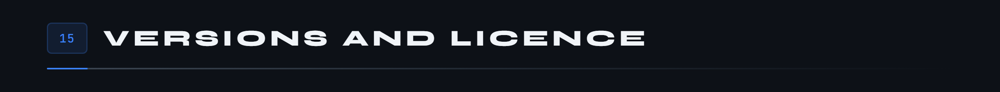

V1 is built, but nothing is released yet. Before the first tag, the backup repository has to move off the VM, the design needs a review from someone outside, then `v0.1.0` gets tagged. After that come the Android app, rotation on your real sites and a more autonomous agent, with no promised date. The cryptography and the licence stay put.


> Serenity has not been audited yet. Keep real accounts out of it until version 0.1.0 and an outside review. The [security page](docs/10-securite.md) (in French) says what has been checked and what remains open.

To report a vulnerability, go through [`SECURITY.md`](SECURITY.md), never a public issue. The scope is kept tight, so open an issue before writing code: [`CONTRIBUTING.md`](CONTRIBUTING.md) explains how to run the project and what to check before a pull request.

Serenity is designed and built by **Tristan Joncour** ([@Cybertrist](https://github.com/Cybertrist)). The code is released under the [GNU AGPL v3](LICENSE) or later, copyright (C) 2026 Tristan. It is the usual choice for a self-hosted server, the Bitwarden server's among others: whoever runs a modified Serenity for other people has to publish its code. The Geist, Geist Mono and Syne fonts are under the SIL Open Font Licence, the Phosphor icons under MIT. Serenity comes with no warranty whatsoever.

---

<sub>No image on this page comes out of a drawing tool. The section banners and the buttons are HTML pages captured by Chrome; the diagrams are animated SVG written by script, redrawing the app's real screens. Everything is in <a href="docs/tools/">docs/tools</a>, and <code>bash docs/tools/tout.sh</code> rebuilds it all, in both languages.</sub>
