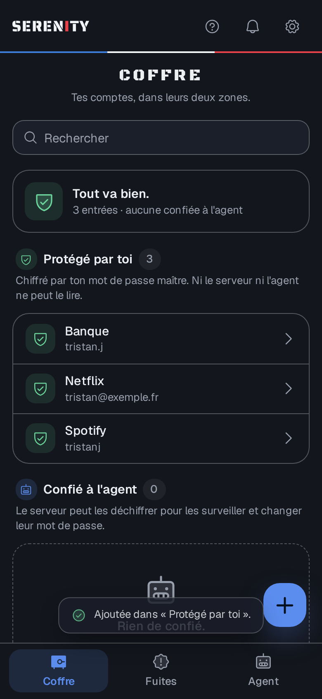
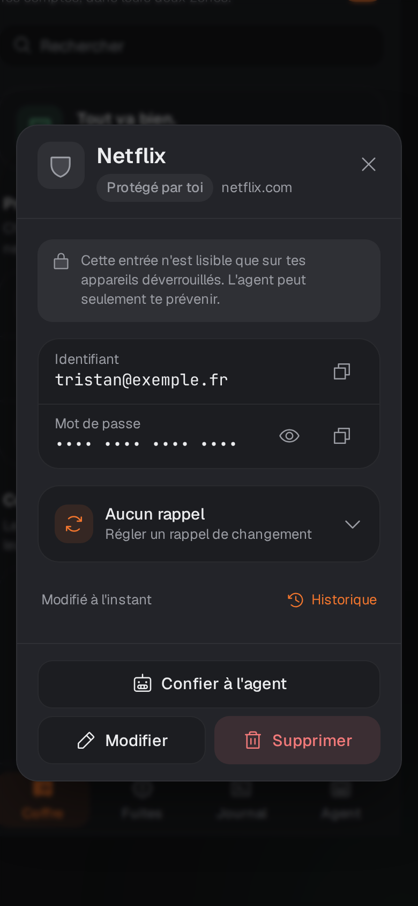
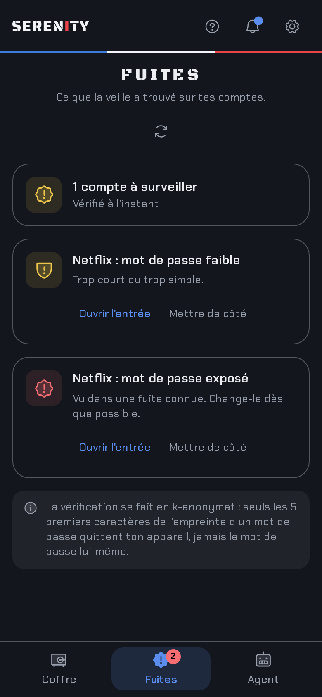
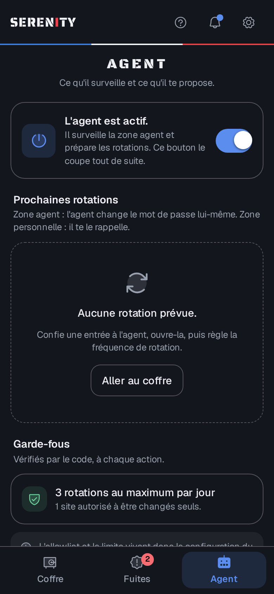

# Serenity

Gestionnaire de mots de passe **complet et auto-hébergé**, avec son propre coffre chiffré.

Sa particularité : un **agent** qui surveille les fuites de données et s'occupe des mots de passe
que tu lui confies. Pas d'humain dans la boucle, mais un humain toujours informé.

<p>
  
  
  
  
</p>

## Le coffre à double zone

| Zone | Pour quoi | Qui peut lire |
|---|---|---|
| **Protégé par toi** | Comptes critiques (banque, e-mail principal…) | Toi seul, avec ton mot de passe maître. Le serveur ne voit que des blocs chiffrés. |
| **Confié à l'agent** | Comptes que tu délègues, un par un | Toi, et l'agent côté serveur, pour surveiller et faire tourner les mots de passe. |

Par défaut, tout va dans la zone personnelle.

## Ce que fait la V1

- Coffre chiffré dans le navigateur (libsodium : Argon2id, XChaCha20-Poly1305), kit de récupération.
- Appli web installable (PWA), en thème clair ou sombre, pensée d'abord pour le mobile.
- Import depuis un export Bitwarden, chiffré sur place, dans le navigateur.
- Veille des fuites : Pwned Passwords (k-anonymat), mots de passe réutilisés, faibles ou anciens.
- Délégation d'entrées à l'agent, planification des rotations avec rappels.
- **L'agent change vraiment les mots de passe** : un conteneur isolé avec navigateur, une
  recette par site, une transaction qui sert le coffre avant le site et sait revenir en arrière.
- Notifications maison, sans service tiers : centre de notifications en temps réel dans l'appli.
- Un kill switch arrête l'agent immédiatement.
- Sauvegarde restic chaque nuit (base chiffrée + clés), avec un exercice de restauration rejoué
  en CI.

Ensuite : l'appli Android native avec notifications (V2), puis la rotation sur tes vrais sites,
avec une recette par site et une extension navigateur (V3).

## Démarrage rapide

```bash
git clone git@github.com:Cybertrist/Serenity.git
cd Serenity
cp .env.example .env   # puis remplis les valeurs
make init
make up
```

L'accès se fait uniquement via ton tailnet Tailscale (`tailscale serve`).
Aucun port n'est exposé hors de `127.0.0.1`.

## Documentation

Tout est dans [`docs/`](docs/README.md), en français, une page par phase.
La spécification cryptographique est dans `docs/crypto.md` (phase 1).

## Sécurité

Les règles non négociables sont dans [`CLAUDE.md`](CLAUDE.md).

> Serenity n'a pas encore été audité. N'y mets pas de comptes réels avant la version 0.1.0
> et un audit externe.
