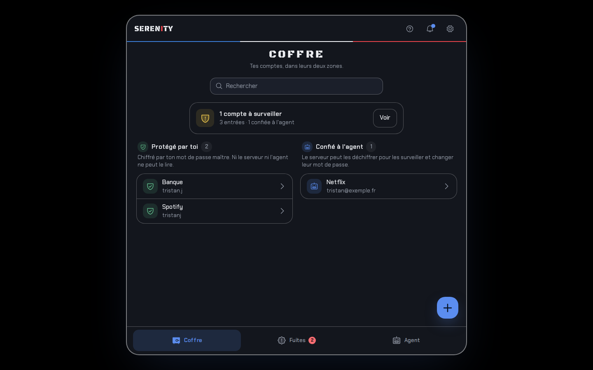
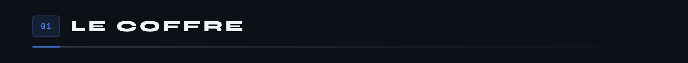
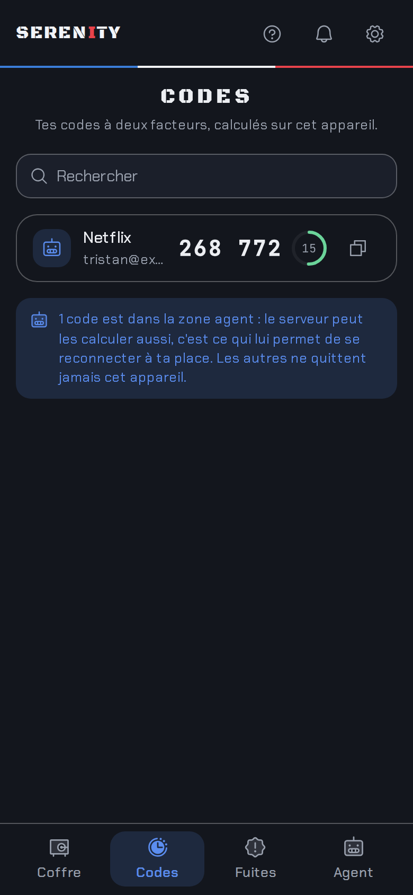
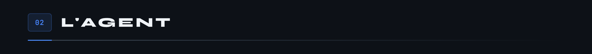
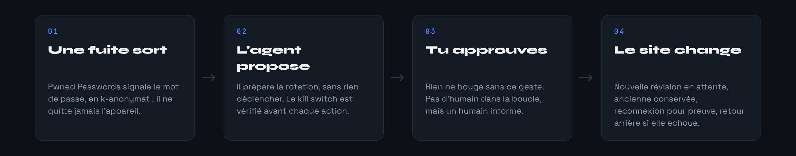
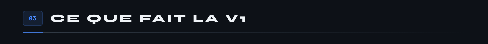
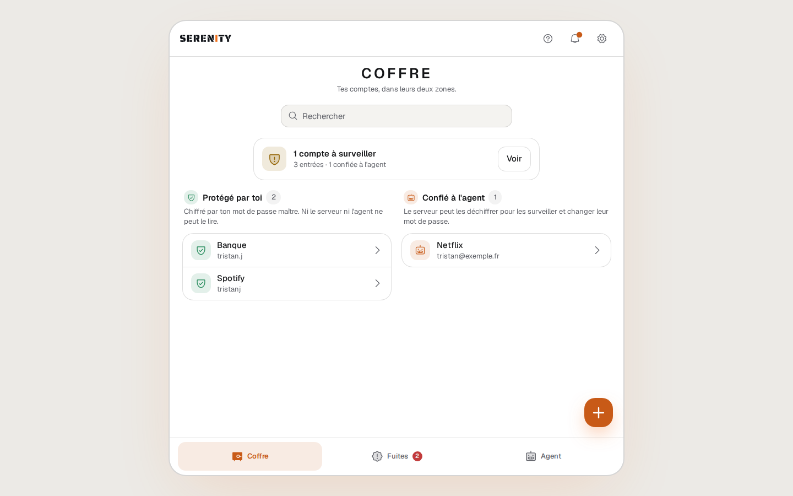
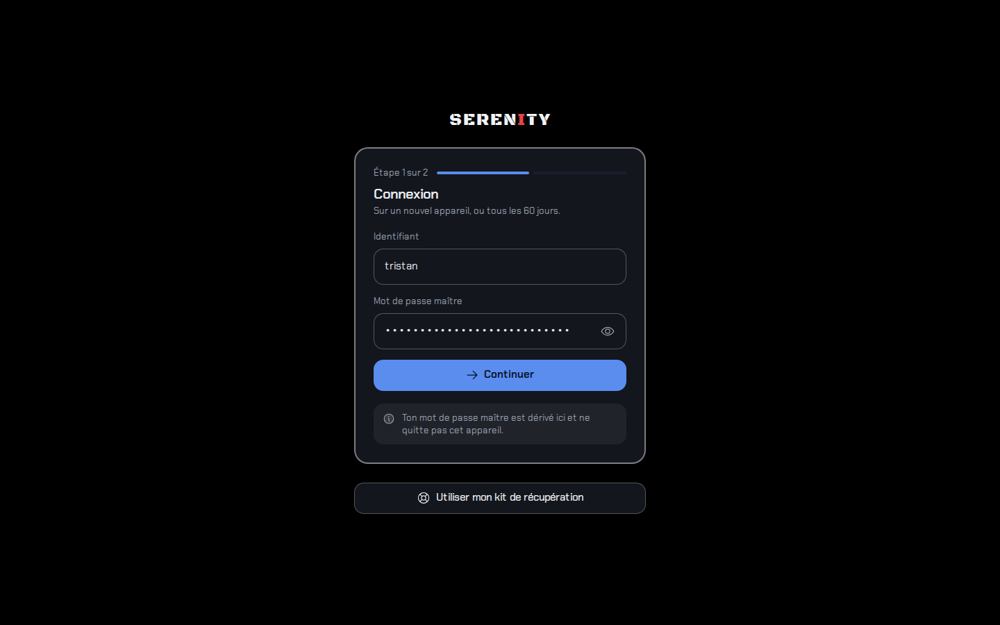
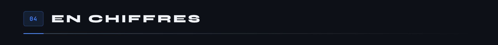
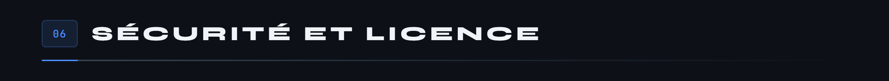

<div align="center">


[](https://github.com/Cybertrist/Serenity/actions/workflows/ci.yml)

</div>

Gestionnaire de mots de passe **complet et auto-hébergé**, avec son propre coffre chiffré. Ni Bitwarden ni Vaultwarden dessous : le coffre, l'API et les clients sont écrits ici.

Sa particularité : un **agent** qui surveille les fuites de données et s'occupe des mots de passe que tu lui confies. Le principe tient en une phrase, pas d'humain dans la boucle, mais un humain toujours informé.





Le coffre a deux zones, et c'est le choix de conception qui commande tout le reste.


<div align="center">





</div>

Sous le capot, une seule bibliothèque de cryptographie, libsodium, et aucune primitive écrite à la main. Le mot de passe maître passe par Argon2id pour donner la clé maître, qui ne quitte jamais l'appareil. Les entrées sont chiffrées en XChaCha20-Poly1305, avec l'identifiant de l'entrée, sa zone et sa révision en données associées : deux blocs chiffrés ne peuvent ni être échangés ni être rejoués. La spécification complète tient dans [`docs/crypto.md`](docs/crypto.md).





La preuve est demandée au site lui-même : l'ancien mot de passe est refusé, le nouveau ouvre la porte. Rien n'est rejoué ni mis en scène, c'est `make film` qui l'enregistre contre le site de démonstration.

<div align="center">


</div>




Un kill switch arrête l'agent immédiatement, et il est vérifié avant chaque action, pas seulement au lancement.

Ensuite viendra l'application Android native avec notifications en V2, puis la rotation sur de vrais sites en V3, avec une recette par site et une extension de navigateur.

<div align="center">




</div>



Au 20 septembre 2026, avant la `v0.1.0`.


```bash
git clone git@github.com:Cybertrist/Serenity.git
cd Serenity
cp .env.example .env   # puis remplis les valeurs
make init
make up
```

**Rien n'est exposé en dehors de `127.0.0.1`.** Serenity ne se met jamais sur Internet : tu l'atteins depuis tes appareils par l'accès privé de ton choix, réseau maillé, VPN, tunnel SSH ou reverse proxy sur ton réseau local. La [page infrastructure](docs/02-infrastructure.md) compare les quatre.

Toute la documentation est dans [`docs/`](docs/README.md), en français, une page par phase.



> Serenity n'a pas encore été audité. N'y mets pas de comptes réels avant la version 0.1.0 et un audit externe.

Les règles non négociables sont dans [`CLAUDE.md`](CLAUDE.md). Pour signaler une faille, passe par [`SECURITY.md`](SECURITY.md), jamais par une issue publique.

Le périmètre est tenu court, donc ouvre une issue avant d'écrire du code. [`CONTRIBUTING.md`](CONTRIBUTING.md) explique comment lancer le projet, quoi vérifier avant une pull request, et les règles qui ne se discutent pas.

Licence [GNU AGPL v3](LICENSE) ou version ultérieure, copyright (C) 2026 Tristan. C'est le choix habituel pour un serveur auto-hébergé, celui du serveur Bitwarden entre autres : qui fait tourner une version modifiée de Serenity pour d'autres personnes doit en publier le code. Serenity est distribué sans aucune garantie.
