<div align="center">

<p>
  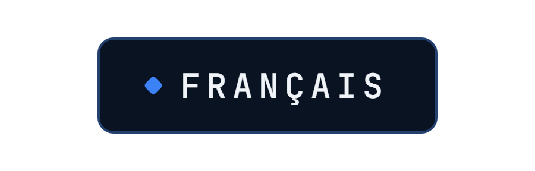
  <a href="README.en.md"></a>
</p>


[](https://github.com/Cybertrist/Serenity/actions/workflows/ci.yml)

</div>

Un gestionnaire de mots de passe complet que tu héberges toi-même, avec son propre coffre chiffré, et un agent qui veille pendant que tu dors.

Je voulais mes mots de passe chez moi, sur ma machine, et pas chez un service qui en garde des millions. Les coffres auto-hébergés existent, mais aucun ne faisait ce qui me manquait vraiment : me dire quand un compte a fui, et changer le mot de passe à ma place quand je le lui demande. Serenity est né de là. Le coffre, l'API et les clients sont écrits ici, sans Bitwarden ni Vaultwarden dessous, avec une seule bibliothèque de cryptographie, libsodium, et aucune primitive faite main.

Tout repose sur un coffre à deux zones. Ce qui compte vraiment, la banque ou la messagerie principale, reste dans ta zone : chiffré sur ton appareil, illisible pour le serveur. Ce que tu confies à l'agent, entrée par entrée, il peut le lire, le surveiller et le changer. Le principe tient en une phrase : pas d'humain dans la boucle, mais un humain toujours informé. Et un kill switch l'arrête net, vérifié avant chaque action.

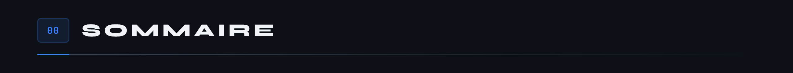

<p align="center">
<a href="#fonctionnalites"></a>
<a href="#ecrans">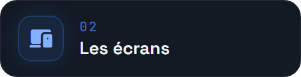</a>
<a href="#installer">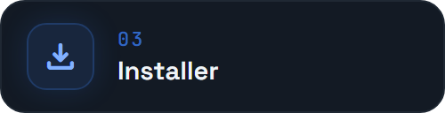</a>
<br>
<a href="#zones">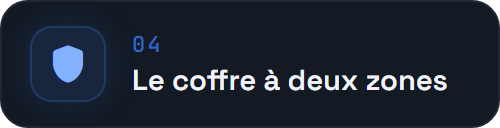</a>
<a href="#cryptographie">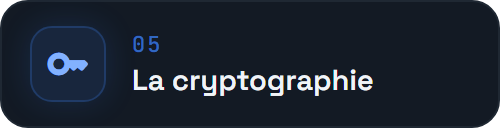</a>
<a href="#connexion">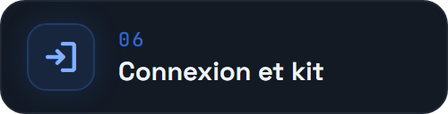</a>
<br>
<a href="#veille">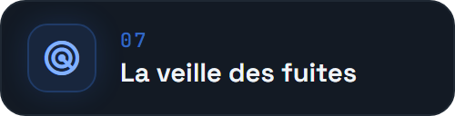</a>
<a href="#agent">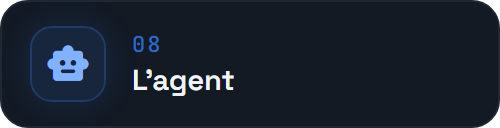</a>
<a href="#rotation">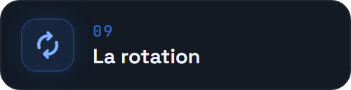</a>
<br>
<a href="#garde-fous">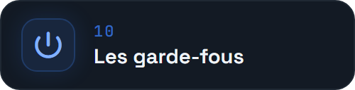</a>
<a href="#codes">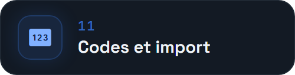</a>
<a href="#sauvegarde">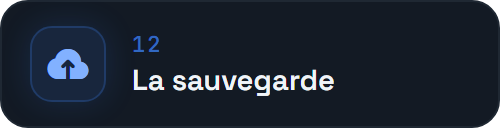</a>
<br>
<a href="#architecture"></a>
<a href="#tests">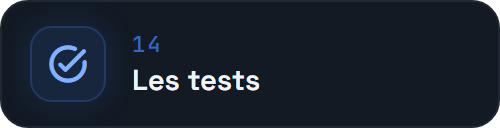</a>
<a href="#versions">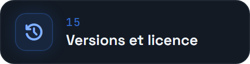</a>
</p>

<a id="fonctionnalites"></a>
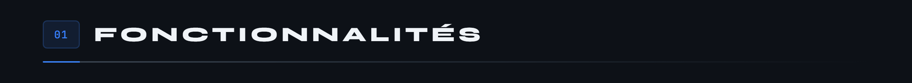

Voici Serenity en onze gestes, du déverrouillage au verrouillage. À gauche, l'appli rejoue ses vrais écrans ; à droite, tu vois ce qui se passe derrière : la clé tirée de ton mot de passe, les cinq caractères qui partent vers Pwned Passwords, la rotation que l'agent te propose avant de toucher à quoi que ce soit. Chaque geste a son propre schéma plus bas.


<a id="ecrans"></a>
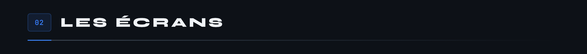

Voici Serenity sur un téléphone, écran par écran. Tout ce que tu vois ici est déchiffré et calculé sur l'appareil : le serveur ne reçoit que des blocs qu'il ne sait pas ouvrir, sauf ceux que tu confies à l'agent.


Sur ordinateur, Serenity tourne dans ton navigateur ou dans son appli de bureau pour Windows et Linux. C'est le même client dans les deux cas. La barre latérale, la palette (Ctrl K) et la barre d'état remplacent les onglets du téléphone, et la lumière derrière le coffre dit où il en est : bleue quand tout va bien, ambre quand un compte a fui, violette quand l'agent travaille, grise quand il est arrêté.


C'est un seul client web qui prend trois formes. Sous 900 px, tu as les cinq onglets en bas, sous le pouce. Au-delà, une barre latérale et la palette. Dans l'appli de bureau, la fenêtre dessine sa propre barre de titre et se verrouille avec ta session. Elle n'embarque aucun code du coffre : elle affiche la page que sert ton serveur, avec la même CSP et les mêmes clés en mémoire seulement.


<a id="installer"></a>
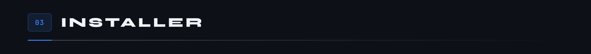

Il te faut une VM avec Docker, quatre commandes, et un chemin privé jusqu'à elle. Serenity n'écoute que sur `127.0.0.1` et ne se met jamais sur Internet : tu l'atteins depuis tes appareils par l'accès privé de ton choix, réseau maillé, VPN, tunnel SSH ou reverse proxy sur ton réseau local. Chez moi, c'est `tailscale serve`. La [page infrastructure](docs/02-infrastructure.md) compare les quatre.

```bash
git clone https://github.com/Cybertrist/Serenity.git
cd Serenity
cp .env.example .env   # puis remplis les valeurs
make init
make up
```

Sur ton ordinateur, prends l'appli de bureau. Au premier lancement, elle te demande l'adresse de ton serveur, en `https` seulement, puis s'ouvre directement sur ton coffre. Les deux boutons mènent à la dernière Release ; la première arrive avec la `v0.1.0`, et d'ici là `make desktop-dist` construit l'installateur de ta plateforme.

<p align="center">
  <a href="https://github.com/Cybertrist/Serenity/releases/latest">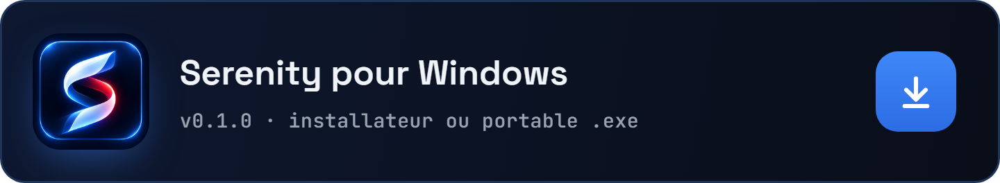</a>
  <a href="https://github.com/Cybertrist/Serenity/releases/latest">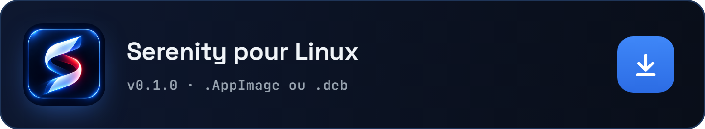</a>
</p>

Les installateurs ne sont pas encore signés : Windows SmartScreen affichera un avertissement au premier lancement. Sur ton téléphone, ouvre l'adresse de ton serveur dans le navigateur, puis « Installer l'application » : c'est une PWA, qui marche aussi hors ligne, en lecture seule.


Toute la documentation est dans [`docs/`](docs/README.md), en français, une page par phase.

<a id="zones"></a>
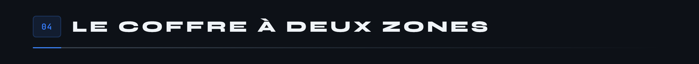

Le coffre a deux zones, et c'est le choix qui commande tout le reste. Une entrée neuve va toujours dans ta zone, chiffrée par une clé qui ne quitte jamais tes appareils. La confier à l'agent est un geste, fait entrée par entrée, avec une confirmation qui dit ce que le serveur pourra faire. Ton appareil la déchiffre alors, la rechiffre avec la clé d'agent, et le serveur refuse le changement de zone sans `confirm: true`.


<a id="cryptographie"></a>
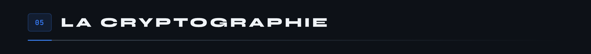

Tout part de ton mot de passe maître, et il ne quitte jamais ton appareil. Argon2id en tire une clé maître qui ne vit que le temps de donner deux sous-clés : l'une ouvre ta clé utilisateur, l'autre est la seule envoyée au serveur, qui n'en garde qu'un hachage. Ta clé utilisateur ouvre la clé d'agent, et ton kit de récupération est une deuxième porte vers elle. Le serveur, lui, ne voit que des blocs chiffrés.


Chaque entrée est un bloc XChaCha20-Poly1305 lié à son contexte : ton compte, l'identifiant de l'entrée, sa zone et sa révision. Ce contexte n'est pas stocké, ton appareil le reconstruit. Si le serveur échange deux blocs, ressort une vieille version ou change une entrée de zone, le déchiffrement refuse, tout simplement. Python et TypeScript vérifient les mêmes vecteurs de test, y compris ceux qui doivent échouer.


La spécification complète tient dans [`docs/crypto.md`](docs/crypto.md) : les primitives, la hiérarchie des clés, les formats octet par octet, chaque flux et le modèle de menace.

<a id="connexion"></a>
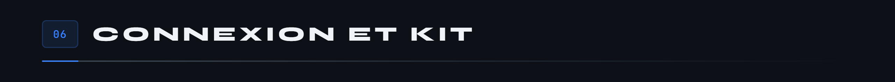

Créer ton compte tient en trois écrans. Ton appareil tire tes clés au hasard et les chiffre avant tout envoi : le serveur ne reçoit que deux clés d'authentification, qu'il hache, et des blocs qu'il ne sait pas ouvrir. Ton premier code à six chiffres active le compte et ferme les inscriptions. Ton kit de récupération ne s'affiche qu'une fois : note-le.


Le code à six chiffres ne t'est demandé que sur un nouvel appareil, puis tous les 60 jours. Au quotidien, ton mot de passe maître suffit : le coffre reste ouvert 15 minutes, prolongées à chaque action, et tes clés ne vivent qu'en mémoire. Sans réseau, tu peux toujours le lire. Si tu oublies ton mot de passe, ton kit et un code te laissent en choisir un nouveau, et tu repars avec un kit neuf.


<a id="veille"></a>
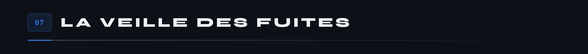

Pour savoir si un mot de passe a fuité, ton appareil calcule son empreinte et n'en envoie que les cinq premiers caractères. Pwned Passwords renvoie quelques centaines de suffixes qui commencent pareil, avec du bourrage, et la comparaison se fait chez toi. Ton serveur ne reçoit que le résultat : quelle entrée, quel type d'alerte. Jamais un mot de passe, ni un nom de site.


Les contrôles locaux ne coûtent rien : ils repassent sur tout le coffre à chaque ouverture de l'onglet. La question à Pwned Passwords, elle, pèse 100 ko par entrée, alors le serveur tient le calendrier : il ne la repose que pour une entrée neuve, un mot de passe changé, ou une vérification vieille de plus de 24 heures. Rouvre l'onglet dix fois, rien ne part sur le réseau.


<a id="agent"></a>
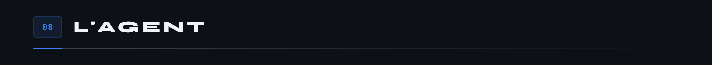

Une fuite sur un compte confié à l'agent n'attend pas : dès le rapport, le serveur vérifie le kill switch et prépare la rotation. Tu reçois une notification, qui ne contient aucun nom (c'est ton appli qui l'écrit), tu vois les quatre étapes, et tu approuves ou tu refuses. Tes entrées personnelles, elles, ne sont jamais touchées : l'agent te prévient, c'est tout.


<a id="rotation"></a>
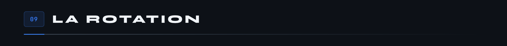

Quand tu approuves, l'agent ne touche pas au site tout de suite. Il range d'abord le nouveau mot de passe dans ton coffre, en révision « en attente », pendant que l'entrée active garde l'ancien. Le rotateur, le seul conteneur qui a un navigateur, se connecte, change, puis se reconnecte de zéro. Seule cette preuve fait de la nouvelle révision la bonne.


Un site peut refuser, ne plus répondre, ou garder on ne sait quel mot de passe. Dans chaque cas, ton coffre garde celui qui ouvre le site : retour arrière si l'ancien passe encore, question posée au site si la réponse s'est perdue. Et si rien n'est sûr, l'agent ne devine pas : ta fiche te montre les deux mots de passe, et tu dis lequel marche.


L'agent ne change que les sites qui ont une recette, un petit fichier JSON qui dit où sont les champs et ce qui prouve qu'une étape a marché. Pour l'instant, un seul en a une : le site de démo du dépôt, sur lequel la CI rejoue la rotation à chaque commit. `make film` l'enregistre de bout en bout, sans rien simuler que le rythme :

<div align="center">


</div>

<a id="garde-fous"></a>
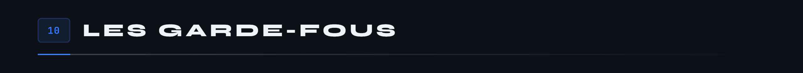

Avant chaque action, c'est du code qui décide, jamais un modèle de langage : kill switch, zone agent, plafond du jour, allowlist, puis une ligne au journal. Le kill switch se maintient une seconde. Relâché trop tôt, il revient ; tenu jusqu'au bout, l'agent s'arrête net et l'interface passe au gris. Certaines choses restent hors de portée pour de bon : pas de code par mail ni par SMS, pas de « mot de passe oublié », pas de CAPTCHA.


<a id="codes"></a>
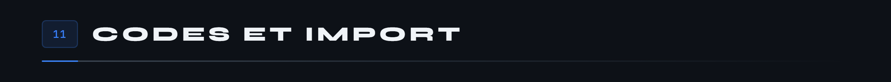

Les codes à deux facteurs se calculent sur ton appareil, à partir du secret rangé dans l'entrée : rien n'est demandé au serveur, et l'écran marche hors ligne. Un toucher copie le code, et Serenity vide le presse-papiers 30 secondes plus tard. Seule exception, voulue : une entrée confiée à l'agent, dont le serveur peut calculer le code lui aussi, pour se reconnecter pendant une rotation.


Tu peux faire entrer tes mots de passe depuis Google ou Bitwarden, et tes codes depuis Google Authenticator. Le fichier est lu et chiffré sur ton appareil : le serveur ne reçoit que des blocs qu'il ne sait pas ouvrir, et tout arrive dans ta zone. Le format se reconnaît au contenu, pas au nom du fichier, et un code importé ne remplace jamais celui d'une entrée : il la rejoint si elle n'en a pas, sinon il devient sa propre entrée.


<a id="sauvegarde"></a>
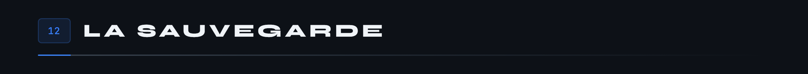

Chaque nuit à 03:12, Serenity sauvegarde ce qui ne se reconstruit pas : la base, copiée par SQLite lui-même, et les deux clés du serveur, dans un instantané restic chiffré. Sans la clé serveur, la zone agent ne se rouvrirait jamais, alors elle part avec. Le mot de passe du dépôt, lui, se garde sur papier, jamais dans Serenity. Et comme une sauvegarde que personne n'a restaurée ne prouve rien, `make backup-check` détruit un coffre d'essai et le restaure, en CI, à chaque push.


<a id="architecture"></a>
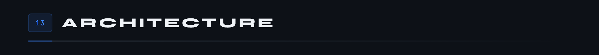

Serenity tourne sur une VM Debian, en quatre conteneurs Docker, et un seul port est publié, sur `127.0.0.1`. Ton téléphone y arrive par un accès privé en HTTPS, et n'envoie que des blocs déjà chiffrés. Seuls l'agent et le rotateur ont le droit de sortir sur Internet : l'un pour demander à Pwned Passwords, l'autre pour ouvrir le site dont il change le mot de passe.


Voici ce qu'un attaquant lit selon ce qu'il obtient. Une sauvegarde sans son mot de passe, ou le réseau, ne lui donnent rien ; la base seule lui donne les métadonnées ; la base avec la clé serveur lui ouvre la zone agent. Le point dur est assumé : qui prend la VM prend la zone agent. Ta zone personnelle, elle, ne s'ouvre que dans un navigateur que tu as déverrouillé.


<a id="tests"></a>
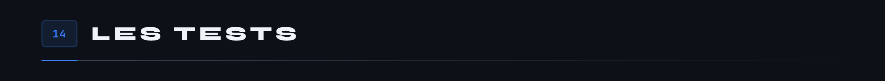

Chaque push rejoue tout, en huit jobs. pytest passe 208 cas côté serveur et vitest 87 côté client. Un bloc chiffré par Python doit s'ouvrir en TypeScript, et l'inverse. Quinze parcours jouent le client contre le vrai serveur, Chromium parcourt tous les écrans sous une CSP stricte, et un coffre jetable est vraiment détruit puis restauré. Une route sans garde, ou un secret dans l'historique, et la CI casse.


<a id="versions"></a>
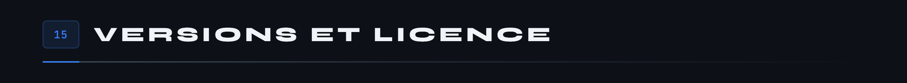

La V1 est construite, mais rien n'est encore publié. Avant le premier tag, il reste à sortir le dépôt de sauvegarde de la VM, à faire relire la conception par quelqu'un d'extérieur, puis à poser la `v0.1.0`. Ensuite viendront l'appli Android, la rotation sur tes vrais sites et un agent plus autonome, sans date promise. La cryptographie et la licence, elles, ne bougent pas.


> Serenity n'a pas encore été audité. N'y mets pas de comptes réels avant la version 0.1.0 et une relecture extérieure. La [page sécurité](docs/10-securite.md) dit ce qui a été vérifié et ce qui reste ouvert.

Pour signaler une faille, passe par [`SECURITY.md`](SECURITY.md), jamais par une issue publique. Le périmètre est tenu court, alors ouvre une issue avant d'écrire du code : [`CONTRIBUTING.md`](CONTRIBUTING.md) explique comment lancer le projet et ce qu'il faut vérifier avant une pull request.

Serenity est conçu et développé par **Tristan Joncour** ([@Cybertrist](https://github.com/Cybertrist)). Le code est publié sous licence [GNU AGPL v3](LICENSE) ou ultérieure, copyright (C) 2026 Tristan. C'est le choix habituel pour un serveur auto-hébergé, celui du serveur Bitwarden entre autres : qui fait tourner une version modifiée de Serenity pour d'autres personnes doit en publier le code. Les polices Geist, Geist Mono et Syne sont sous licence SIL Open Font, les icônes Phosphor sous licence MIT. Serenity est distribué sans aucune garantie.

---

<sub>Les images de cette page ne sortent d'aucun logiciel de dessin. Les bandeaux et les boutons sont des pages HTML que Chrome capture ; les schémas sont des SVG animés écrits par script, qui redessinent les vrais écrans de l'appli. Tout est dans <a href="docs/tools/">docs/tools</a>, et <code>bash docs/tools/tout.sh</code> refait tout, dans les deux langues.</sub>
