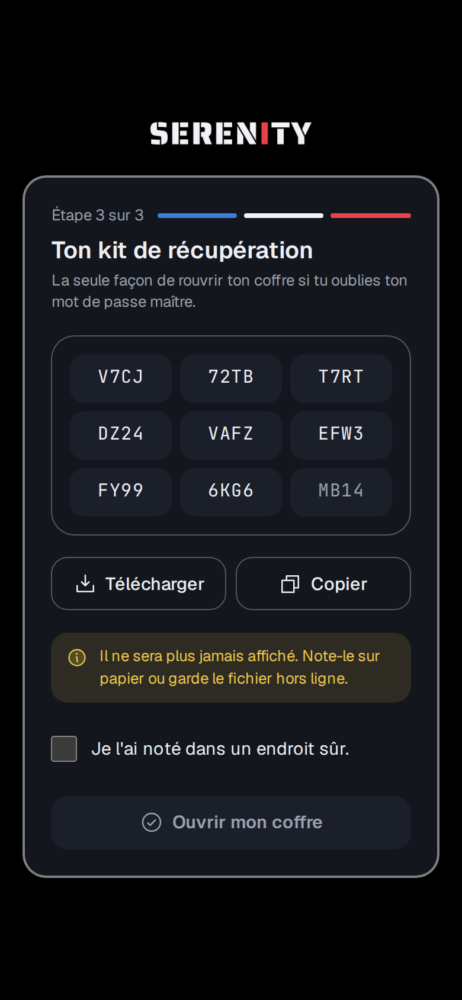
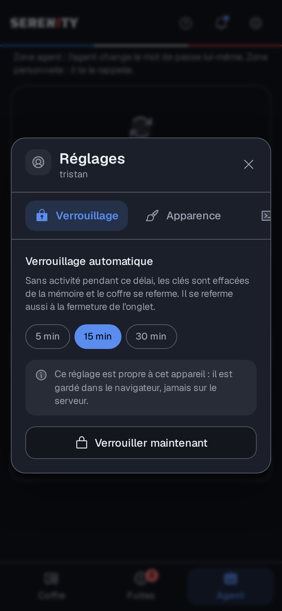
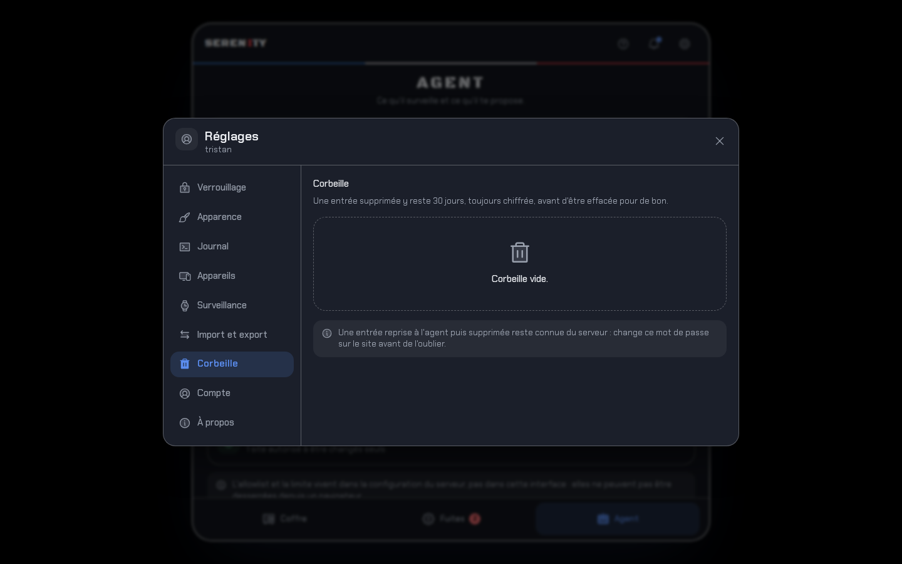
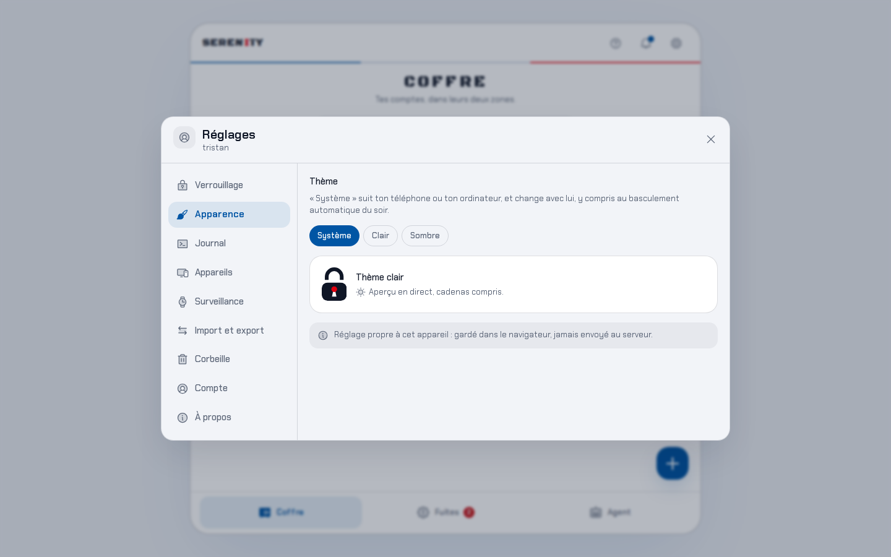

# 07 : Interface

## Quoi

L'appli web installable (PWA), en React, qui fait **toute la cryptographie de la zone
personnelle dans ton navigateur**. Elle tient dans **un carré centré** (côté =
min(92vw, 92vh, 980px)), qui devient le plein écran sous 768 px, et s'ouvre par **un cadenas**
(voir [`design.md`](design.md)).

| Écran | Contenu |
|---|---|
| **Bienvenue** | Création du compte en 3 étapes : identifiant et mot de passe maître, code TOTP à six cases, **kit de récupération** (téléchargeable, avec confirmation « je l'ai noté ») |
| **Connexion** | Nouvel appareil, ou tous les 60 jours : identifiant et mot de passe maître, puis le code TOTP à six cases |
| **Déverrouillage** | Au quotidien : mot de passe maître seul (fonctionne hors ligne) |
| **Récupération** | Kit + code, nouveau mot de passe maître, **nouveau kit** |
| **Coffre** | Les deux zones, chacune avec une phrase qui dit qui peut la lire (côte à côte dès que le carré dépasse 620 px), **le logo du site sur chaque ligne**, recherche, ajout avec générateur |
| **Fiche** (dialogue centré) | Copier l'identifiant, afficher / copier le mot de passe (effacé du presse-papiers après 30 s), code TOTP en direct, rotation ou rappel, **arbitrage quand une rotation a laissé deux mots de passe**, historique, **Confier à l'agent / Reprendre**, modifier, supprimer (les trois derniers avec confirmation) |
| **Codes** | Tous les codes à deux facteurs du coffre sur un écran : code en direct, anneau des secondes restantes, copie en un geste, recherche. Chaque ligne porte le logo de son site, et un mot dit lesquels le serveur peut calculer aussi |
| **Fuites** | Veille lancée à l'ouverture de l'onglet, une alerte par carte, « Ouvrir l'entrée » et « Mettre de côté » |
| **Journal** (dans les réglages) | Filtres Tout / Agent / Toi / Système, regroupé par jour ; l'écran Agent y renvoie |
| **Agent** | Kill switch (avec confirmation), rotations à approuver ou refuser, prochaines rotations, garde-fous |
| **Guide** (dialogue) | Cinq écrans : le coffre, les deux zones, les fuites, l'agent, et un parcours d'essai en cinq étapes |
| **Notifications** (dialogue) | Ce que l'agent et la veille ont signalé, non lues en tête, « Tout marquer comme lu » ; une notification ouvre l'entrée ou l'onglet Fuites |
| **Réglages** (dialogue en volets) | Verrouillage, **apparence** (thème clair ou sombre), **journal**, appareils connectés, adresses surveillées, **import** (Google, Bitwarden, codes Authenticator) et export, **corbeille** (restaurer une entrée supprimée), compte (mot de passe maître, **régénération du kit de récupération**, déconnexion), **à propos** (code source, licence) |

<p>
  
  
  
  
  
</p>

<p>
  
  
  
</p>

<p>
  
</p>

<p>
  
</p>

<p>
  
  
</p>

## Pourquoi

- **Les clés ne vivent qu'en mémoire** (règle 3) : jamais dans localStorage, IndexedDB ou le
  service worker. Le verrouillage (15 min d'inactivité par défaut, réglable 5 / 15 / 30,
  fermeture de la page, bouton) les efface.
- **Hors ligne** : IndexedDB garde une copie **chiffrée** du coffre (blocs, clés enveloppées, sel).
  Sans réseau, le service worker sert l'appli, et ton mot de passe maître déverrouille ce cache
  localement : lecture seule, jusqu'au retour du réseau.
- **CSP stricte** (`web/security-headers.conf`) : aucun script en ligne, `wasm-unsafe-eval`
  seulement pour libsodium, sorties réseau limitées à Serenity et à Pwned Passwords, polices
  servies localement, pas d'intégration dans une autre page. En-têtes : HSTS, COOP, CORP,
  `no-referrer`, `nosniff`, `Permissions-Policy`.
- **Les codes à deux facteurs sont calculés ici** (`web/src/lib/totp.ts`, RFC 6238 avec Web
  Crypto), à partir du secret rangé dans l'entrée. Rien n'est demandé au serveur, et l'onglet
  Codes marche hors ligne. Un secret rangé dans la **zone agent** est en revanche lisible par le
  serveur, qui peut donc produire le même code : c'est ce qui permet à l'agent de se reconnecter
  pendant une rotation, et l'écran le dit.
- **Temps réel** : tant que l'appli est ouverte, les nouvelles alertes et rotations arrivent par
  `/api/events`, mettent l'écran à jour et s'empilent dans le centre de notifications (la cloche).
- **Rien d'irréversible sans un mot d'explication** : supprimer, confier, reprendre, déconnecter
  un appareil ou couper l'agent passent par un dialogue qui dit ce qui va se passer (ADR-012).
- **Bleu blanc rouge** : le bleu de France porte les actions, le rouge Marianne les alertes, et
  le drapeau entier ne sort qu'à trois endroits qui disent quelque chose : le filet sous la barre
  de titre, les trois étapes de la création de compte, la cascade de déverrouillage
  ([ADR-017](decisions/ADR-017-identite-francaise.md)).
- **Charte** respectée : voir [`design.md`](design.md).

### Le logo d'une entrée

Chaque ligne du coffre porte le logo de son site, à la place du bouclier ou du robot d'avant. La
marque de zone n'a pas disparu : elle reste en tête de chaque zone, et la fiche d'une entrée dit
« Protégé par toi » ou « Confié à l'agent » en toutes lettres.

Trois sources, dans cet ordre ([ADR-019](decisions/ADR-019-logos-des-entrees.md)) :

1. **Le pack embarqué**, 3455 marques dessinées dans l'image web à la construction. Le navigateur
   déduit la marque du domaine qu'il a déjà en mémoire, puis demande un fichier à Serenity.
   Aucun domaine n'est envoyé nulle part, et nginx ne journalise pas cette route.
2. **La vraie favicon, pour les entrées confiées à l'agent.** C'est l'agent qui va la chercher,
   une fois par jour, et qui la range chiffrée avec AK : l'api sert un bloc qu'elle ne sait pas
   lire, ton navigateur l'ouvre. La zone personnelle n'est jamais concernée
   ([ADR-020](decisions/ADR-020-icones-de-la-zone-agent.md)).
3. **La favicon du site**, seulement si tu l'as activée (voir plus bas). Coupée par défaut.
4. **Le monogramme** : la première lettre, sur une couleur stable tirée du domaine. C'est ce que
   voient les sites que le pack ne connaît pas, dont beaucoup de services français : Crédit
   Agricole, Ameli, Doctolib, Leboncoin, ainsi qu'Amazon et LinkedIn, retirés du pack pour des
   raisons de marque.

Pour activer la favicon distante, dans `.env` sur la VM :

```
SERENITY_FAVICONS_DISTANTES=true
```

puis `make up`. Attention à ce que ça couvre vraiment : le navigateur ne peut tenter qu'une seule
adresse, `https://<domaine>/favicon.ico`. Un site qui range son icône ailleurs et la déclare dans
le HTML de sa page d'accueil ne donnera rien, parce qu'un navigateur n'a pas le droit de lire le
HTML d'un autre site. Mesuré le 21 septembre 2026 : Amazon, Ameli, Doctolib, Leboncoin et le
Crédit Agricole donnent leur icône ; La Poste (elle est dans `/ecom/`), Grindr (sur un CDN) et
impots.gouv.fr (dans `/libraries/dsfr/`) ne donnent rien. Pour ceux-là, confier l'entrée à
l'agent marche : lui lit la page d'accueil et suit la déclaration.

Ce que le réglage change par ailleurs, et c'est le seul de Serenity qui retire une protection :
chaque site apprend ton adresse IP et l'heure à laquelle tu ouvres ton coffre, et la CSP passe à
`img-src 'self' data: blob: https:`, ce qui permettrait à un script injecté dans la page de faire
sortir des données dans l'URL d'une image. C'est pour ça que le réglage vit dans `.env` et pas
dans les réglages de l'appli : la CSP est posée par nginx au chargement de la page, une case à
cocher dans l'interface ne pourrait pas la commander.

## Comment tester

### Tests automatiques (sur la VM)

```bash
make web-test     # lint, types, build de production, tests unitaires
make e2e          # parcours TypeScript contre le vrai serveur
make ui-smoke     # Chromium parcourt tous les écrans (image de production, CSP stricte),
                  # y compris le mode hors ligne ; captures dans web/e2e/shots/
```

`make ui-smoke` fait trois passages : un gabarit de téléphone (390 px), une fenêtre de 1440 px
pour la mise en page de bureau, puis un passage complet en **thème clair**. Il échoue à la
moindre erreur JavaScript ou violation de CSP, et tourne aussi en CI (captures dans l'artefact
`ui-screenshots`).

### En vrai (navigateur, depuis un de tes appareils)

1. Sur la VM : `make up`.
2. Ouvre Serenity sur le nom d'hôte que tu as choisi : écran « Connexion ».
3. Connecte-toi avec ton compte (`tristan`, mot de passe maître, code TOTP) : tu retrouves les
   entrées créées avec `make client`.
4. **Installer l'appli** : sur Android (Chrome), menu ⋮ → « Installer l'application » ; sur
   ordinateur, l'icône d'installation dans la barre d'adresse.
5. Essaie : ajouter une entrée avec le générateur, l'ouvrir, copier le mot de passe, la confier
   à l'agent, l'onglet Fuites, le kill switch dans Agent, « Verrouiller maintenant » dans les
   réglages.
6. Hors ligne : verrouille, coupe le réseau (mode avion), rouvre l'appli installée,
   déverrouille : le coffre s'affiche en lecture seule.
7. Sur ordinateur, redimensionne la fenêtre : le carré suit, et sous 768 px il devient le plein
   écran. Au déverrouillage, la cascade de données doit se jouer **une seule fois**.
