# 07 : Interface

## Quoi

L'appli web installable (PWA), en React, qui fait **toute la cryptographie de la zone
personnelle dans ton navigateur**. Elle occupe toute la fenêtre et prend trois formes avec le
même code (voir [`design.md`](design.md) et [ADR-020](decisions/ADR-020-refonte-aurora.md)) :

- **sur un téléphone**, cinq onglets en bas : Coffre, Codes, Fuites, Agent, Réglages ;
- **dans un navigateur**, dès 900 px : une barre latérale, une recherche en haut qui ouvre la
  palette (Ctrl K), et une barre d'état en pied de page ;
- **dans l'appli de bureau** Windows et Linux : la même chose, sous une barre de titre dessinée
  par l'appli ([`11-bureau.md`](11-bureau.md)).

Derrière le contenu, une lumière dit où en est le coffre : bleue quand tout va bien, ambre quand
quelque chose a fui, violette quand l'agent travaille, grise quand il est arrêté.

| Écran | Contenu |
|---|---|
| **Bienvenue** | Création du compte en 3 étapes : identifiant et mot de passe maître, code TOTP à six cases, **kit de récupération** (téléchargeable, avec confirmation « je l'ai noté ») |
| **Connexion** | Nouvel appareil, ou tous les 60 jours : identifiant et mot de passe maître, puis le code TOTP |
| **Déverrouillage** | Au quotidien : mot de passe maître seul (fonctionne hors ligne). Le coffre s'ouvre derrière un faisceau de lumière |
| **Récupération** | Kit + code, nouveau mot de passe maître, **nouveau kit** |
| **Coffre** | Une phrase d'abord (« Tout va bien. » ou « Une chose demande ton attention. ») avec la suite à donner et, sur téléphone, l'anneau de santé ; le filtre Tout / Toi / Agent ; les deux zones, chacune avec qui peut la lire ; recherche (`/`), ajout avec générateur (Ctrl N), import. Sur grand écran, la liste et la fiche sont côte à côte et se parcourent aux flèches |
| **Fiche** | Plein écran sur téléphone, panneau à droite sur grand écran : copier l'identifiant, afficher ou copier le mot de passe (effacé du presse-papiers après 30 s), code TOTP en direct, rotation ou rappel, **arbitrage quand une rotation a laissé deux mots de passe**, historique, **Confier à l'agent / Reprendre**, modifier, supprimer |
| **Codes** | Tous les codes à deux facteurs du coffre : code en direct, compte à rebours, copie en un geste, recherche. Chaque code porte le monogramme de l'entrée et la pastille de sa zone, et une phrase dit lesquels le serveur peut calculer aussi |
| **Fuites** | L'anneau de santé en grand, les compteurs (fuites, réutilisés, faibles, anciens, e-mails), une alerte par carte, les plus graves d'abord, avec « Voir la proposition », « Changer moi-même » et « Mettre de côté » ; puis comment la veille vérifie |
| **Agent** | Le **kill switch à maintenir 1 s**, la **frise des 24 dernières heures** tirée du journal, les compteurs, les rotations à approuver (Entrée) ou refuser avec les quatre étapes de ce que l'agent fera, les prochaines rotations, les garde-fous |
| **Réglages** (écran) | Cet appareil : verrouillage, **apparence** (sombre, clair ou comme le système). Coffre : adresses surveillées, **import** (Google, Bitwarden, codes Authenticator) et export, **corbeille**, **journal**. Compte : **kit de récupération** (régénération), appareils connectés, compte (mot de passe maître, déconnexion), **à propos** (code source, licence, et si l'appli de bureau est utilisée) |
| **Palette** (Ctrl K) | Chaque entrée, chaque écran, chaque action : suggestions tirées de l'état du coffre, nouvelle entrée, générateur, verrouiller, thème, réglages, notifications, journal, import, guide. Ctrl Entrée copie le mot de passe d'une entrée |
| **Guide** (dialogue) | Le coffre, les deux zones, les fuites, l'agent, et un parcours d'essai en cinq étapes |
| **Notifications** (dialogue) | Ce que l'agent et la veille ont signalé, non lues en tête, « Tout marquer comme lu » ; une notification ouvre l'entrée ou l'écran concerné |

Sur un téléphone :

<p>
  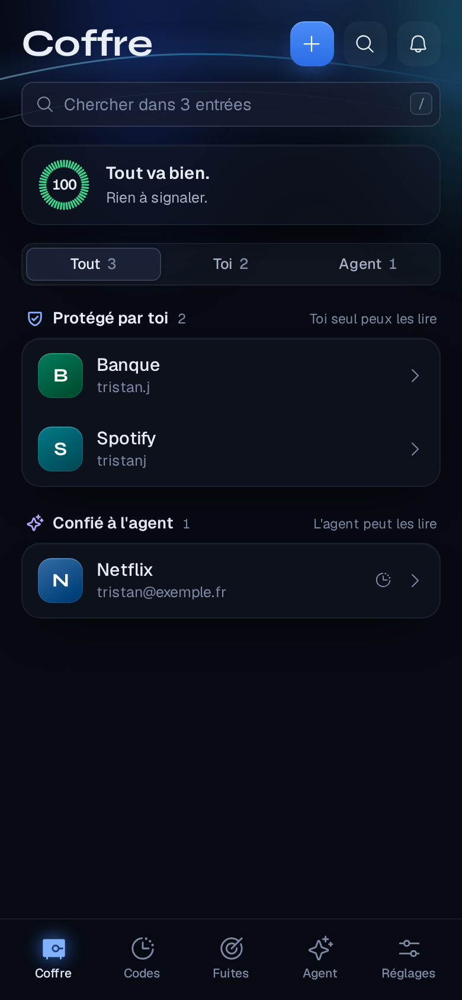
  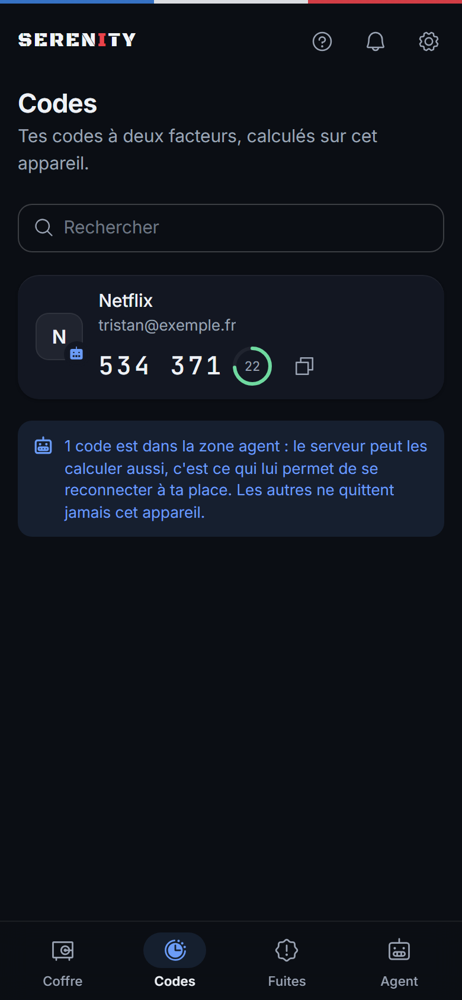
  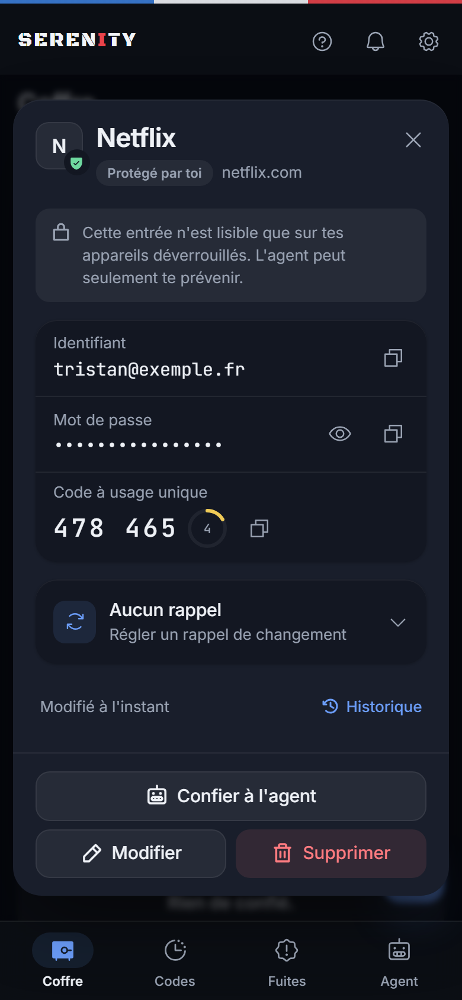
  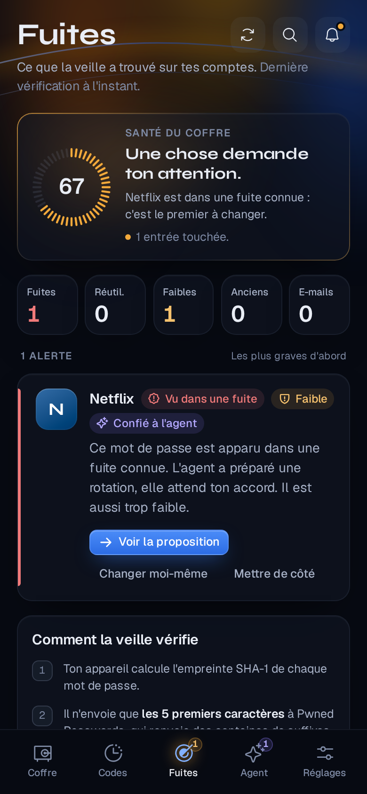
</p>

<p>
  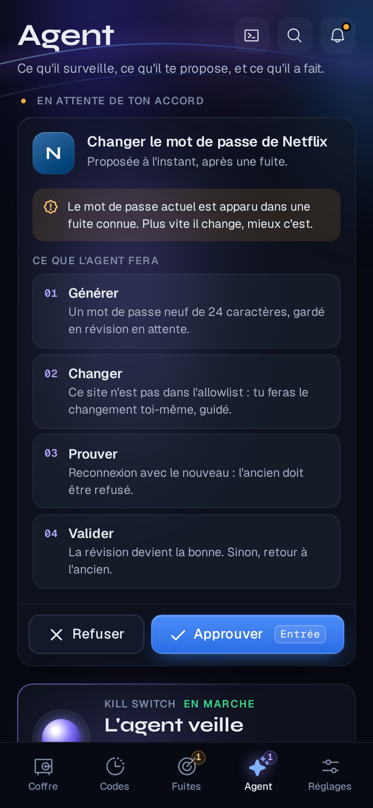
  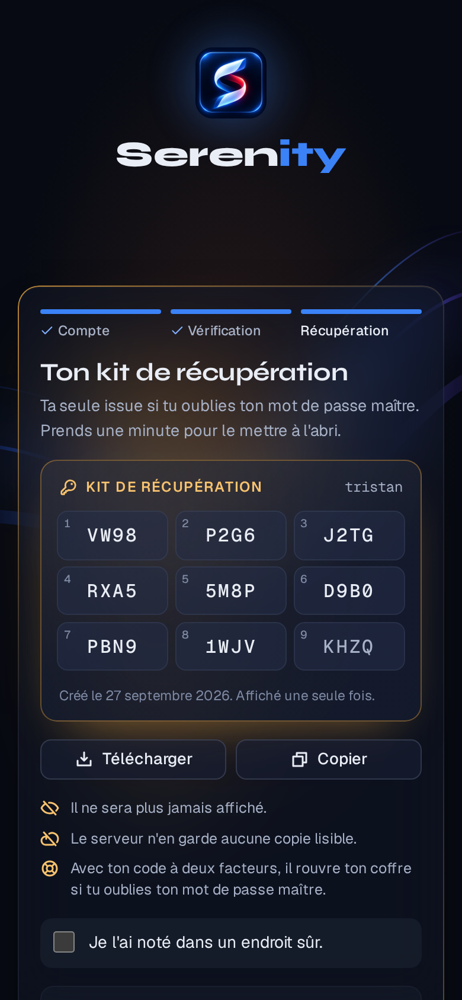
  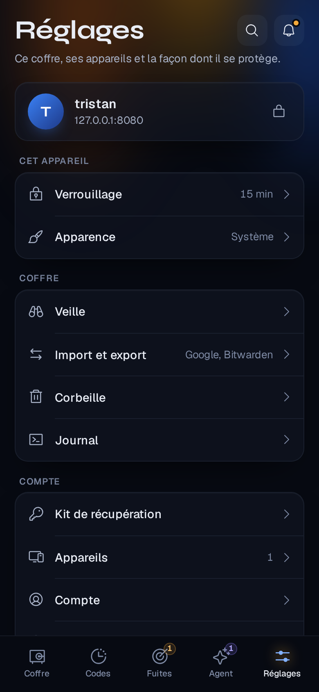
</p>

Dans un navigateur, sur un grand écran :

<p>
  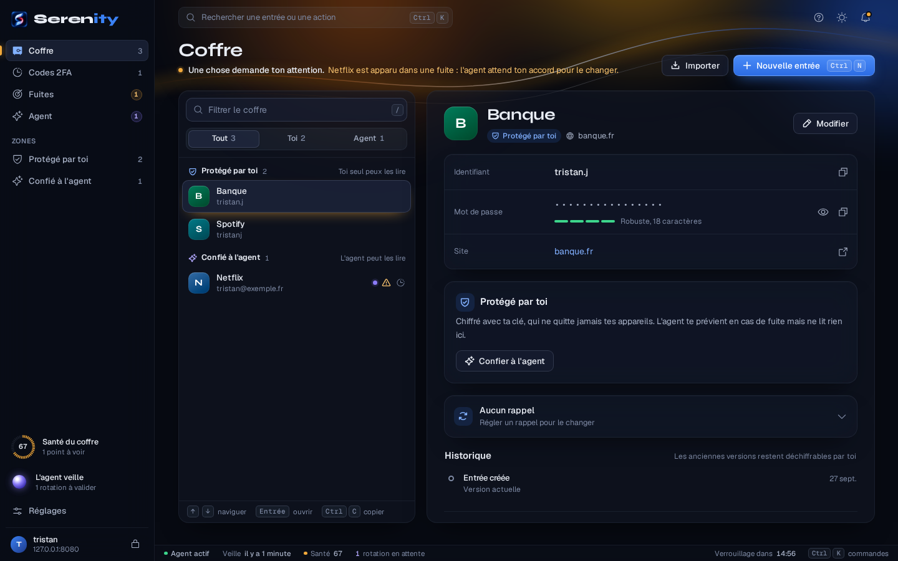
</p>

<p>
  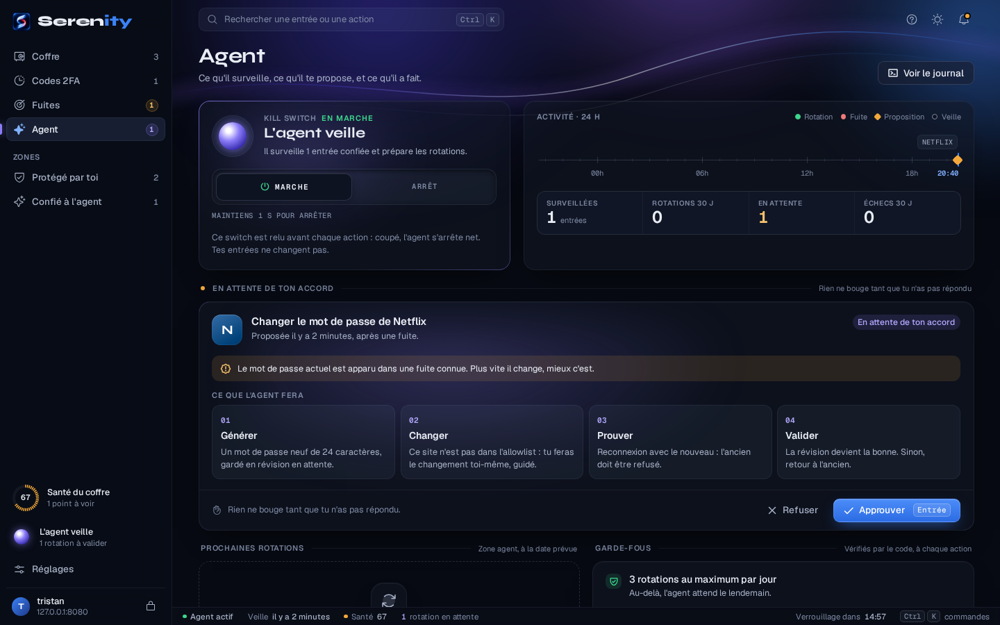
  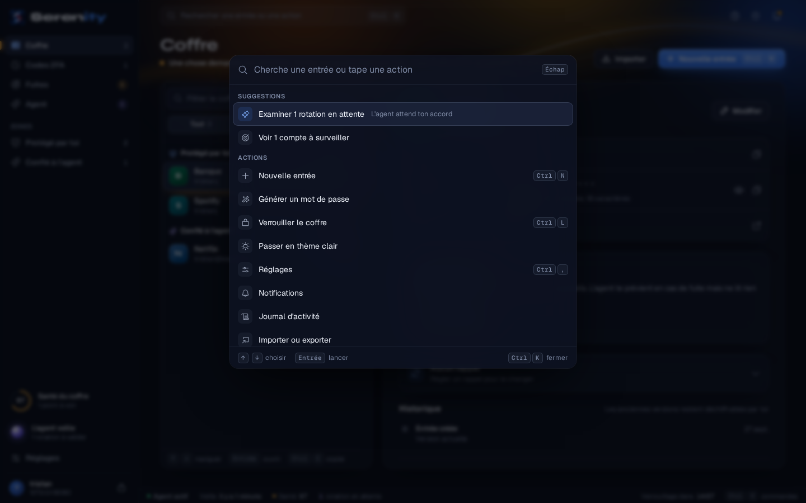
</p>

<p>
  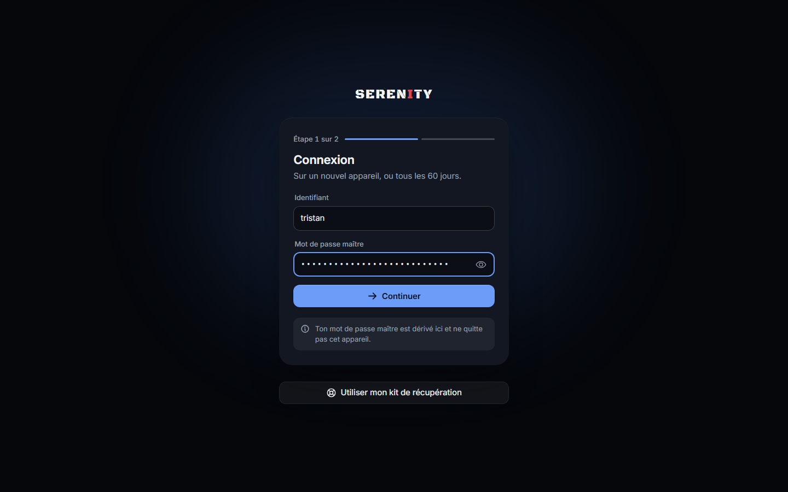
  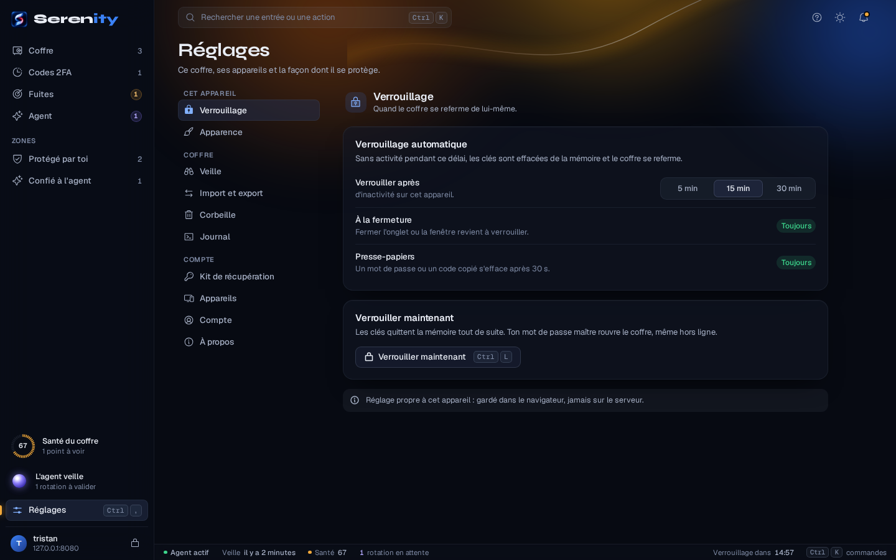
</p>

<p>
  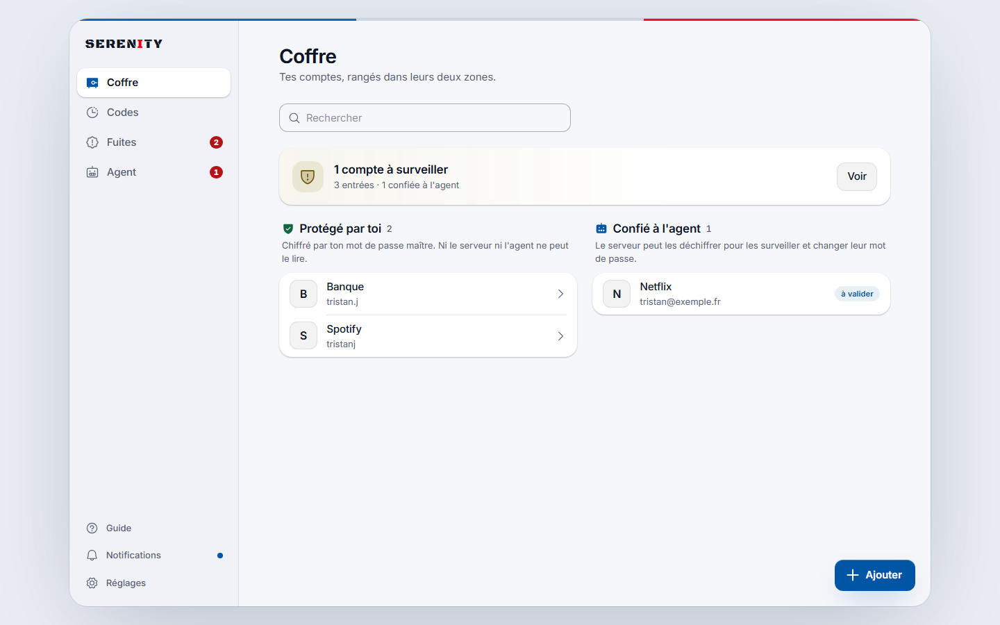
  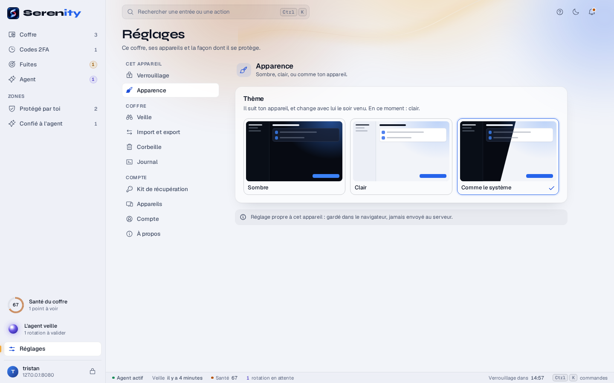
</p>

## Navigation

- **Téléphone** : les cinq onglets en bas. Fuites et Agent portent une pastille quand quelque
  chose attend (ambre pour les points à voir, violette pour les rotations à valider). La
  recherche et la cloche sont en haut de chaque écran, l'ajout en haut du coffre.
- **Grand écran** : la barre latérale porte les quatre écrans avec leurs compteurs, les deux
  zones (un clic filtre le coffre), l'anneau de santé (qui mène à Fuites), l'orbe de l'agent (qui
  mène à Agent), les réglages, et ton nom avec le bouton de verrouillage. La barre d'état en pied
  de page est cliquable : l'agent mène à Agent, la santé à Fuites.
- **Clavier**, partout : Ctrl K pour la palette, G puis V, C, F ou A pour changer d'écran,
  `/` pour chercher, Ctrl N pour une nouvelle entrée, Ctrl L pour verrouiller, Ctrl , pour les
  réglages, les flèches et Entrée dans la liste du coffre. Chaque raccourci est écrit à côté du
  bouton qui fait la même chose.

## Pourquoi

- **Les clés ne vivent qu'en mémoire** (règle 3) : jamais dans localStorage, IndexedDB ou le
  service worker. Le verrouillage (15 min d'inactivité par défaut, réglable 5 / 15 / 30,
  fermeture de la page, bouton) les efface.
- **Hors ligne** : IndexedDB garde une copie **chiffrée** du coffre (blocs, clés enveloppées, sel).
  Sans réseau, le service worker sert l'appli, et ton mot de passe maître déverrouille ce cache
  localement : lecture seule, jusqu'au retour du réseau.
- **CSP stricte** (`web/security-headers.conf`) : aucun script en ligne, `wasm-unsafe-eval`
  seulement pour libsodium, sorties réseau limitées à Serenity et à Pwned Passwords, polices
  servies localement, pas d'intégration dans une autre page. En-têtes : HSTS, COOP, CORP,
  `no-referrer`, `nosniff`, `Permissions-Policy`.
- **Les codes à deux facteurs sont calculés ici** (`web/src/lib/totp.ts`, RFC 6238 avec Web
  Crypto), à partir du secret rangé dans l'entrée. Rien n'est demandé au serveur, et l'onglet
  Codes marche hors ligne. Un secret rangé dans la **zone agent** est en revanche lisible par le
  serveur, qui peut donc produire le même code : c'est ce qui permet à l'agent de se reconnecter
  pendant une rotation, et l'écran le dit.
- **Temps réel** : tant que l'appli est ouverte, les nouvelles alertes et rotations arrivent par
  `/api/events`, mettent l'écran à jour et s'empilent dans le centre de notifications (la cloche).
- **Rien d'irréversible sans un mot d'explication** : supprimer, confier, reprendre ou
  déconnecter un appareil passent par un dialogue qui dit ce qui va se passer (ADR-012). Le kill
  switch se maintient 1 s au lieu de se confirmer : le geste est la confirmation, et il se
  relâche avant la fin si on change d'avis.
- **La lumière dit l'état, jamais un écran seul** : les couleurs de fond sont pilotées par
  `data-mood`, calculé à partir des vraies données. Tant que le serveur n'a pas répondu, rien ne
  dit « Tout va bien ».
- **Charte** respectée : voir [`design.md`](design.md).

## Comment tester

### Tests automatiques (sur la VM)

```bash
make web-test     # lint, types, build de production, tests unitaires
make e2e          # parcours TypeScript contre le vrai serveur
make ui-smoke     # Chromium parcourt tous les écrans (image de production, CSP stricte),
                  # y compris le mode hors ligne ; captures dans web/e2e/shots/
```

`make ui-smoke` fait trois passages : un gabarit de téléphone (390 px), une fenêtre de 1440 px
pour la mise en page de bureau, puis un passage complet en **thème clair**. Il échoue à la
moindre erreur JavaScript ou violation de CSP, et tourne aussi en CI (captures dans l'artefact
`ui-screenshots`).

### En vrai (navigateur, depuis un de tes appareils)

1. Sur la VM : `make up`.
2. Ouvre Serenity sur le nom d'hôte que tu as choisi : écran « Connexion ».
3. Connecte-toi avec ton compte (`tristan`, mot de passe maître, code TOTP) : tu retrouves les
   entrées créées avec `make client`.
4. **Installer l'appli** : sur Android (Chrome), menu ⋮ → « Installer l'application » ; sur
   ordinateur, l'icône d'installation dans la barre d'adresse, ou l'appli de bureau
   ([`11-bureau.md`](11-bureau.md)).
5. Essaie : ajouter une entrée avec le générateur, l'ouvrir, copier le mot de passe, la confier
   à l'agent, l'onglet Fuites, le kill switch dans Agent (maintiens-le 1 s), « Verrouiller
   maintenant » dans les réglages.
6. Hors ligne : verrouille, coupe le réseau (mode avion), rouvre l'appli installée,
   déverrouille : le coffre s'affiche en lecture seule.
7. Sur ordinateur, redimensionne la fenêtre : sous 900 px, la barre latérale et la barre d'état
   laissent la place aux cinq onglets du bas. Au déverrouillage, le faisceau de lumière doit passer
   **une seule fois**, puis le coffre monte en place.
8. Au clavier : Ctrl K, tape le nom d'une entrée, Ctrl Entrée copie son mot de passe. G puis F
   ouvre Fuites, Ctrl L verrouille.
