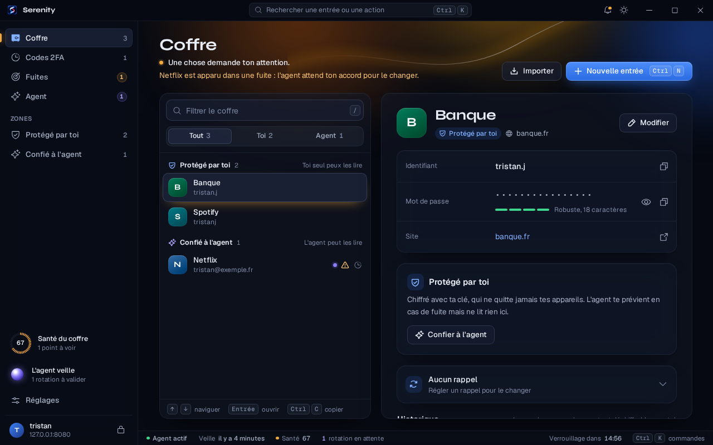
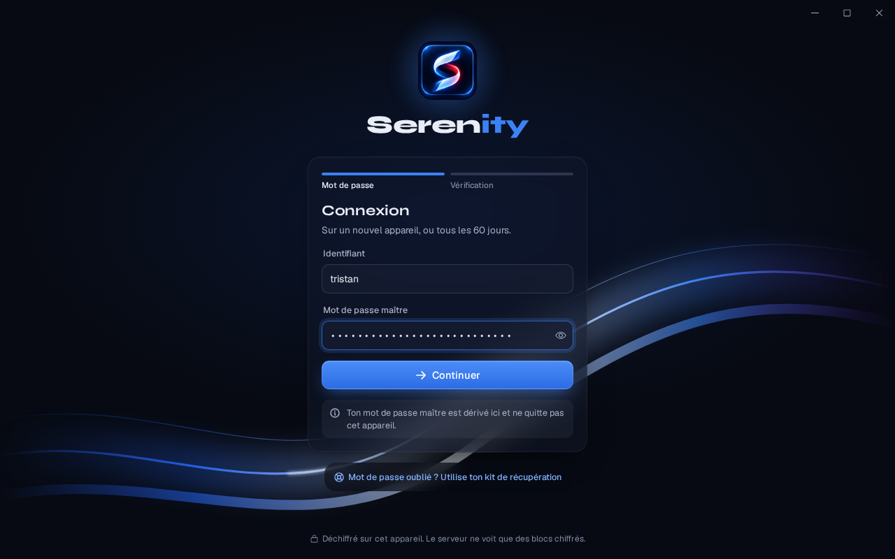
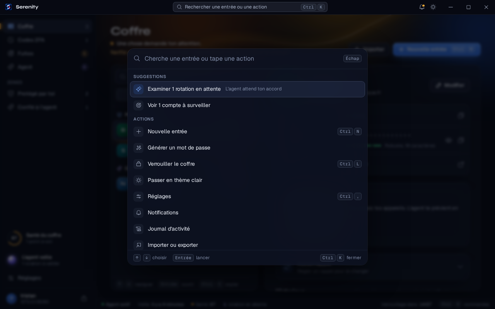

# 11 : Appli de bureau

## Quoi

Serenity pour **Windows et Linux**, dans sa propre fenêtre (`desktop/`, Electron). Au premier
lancement, l'appli demande l'adresse de ton serveur Serenity ; ensuite, elle ouvre directement
ton coffre.

Elle n'embarque **pas** le code du coffre : elle affiche le client web servi par ton serveur, le
même que dans le navigateur. Ce qu'elle ajoute, c'est ce qu'un onglet ne sait pas faire :

- **une fenêtre sans cadre**, dont l'appli dessine elle-même la barre de titre : le logo, la
  recherche au centre (Ctrl K), la cloche, le thème, puis réduire, agrandir et fermer à droite.
  On la déplace en la tirant par cette barre, un double clic l'agrandit ;
- **le verrouillage avec la machine** : le coffre se verrouille quand tu verrouilles ta session,
  quand la machine se met en veille, ou quand tu changes d'utilisateur ;
- **un raccourci global**, Ctrl Maj Espace, qui montre ou cache la fenêtre depuis n'importe où ;
- **une seule instance** : relancer l'appli ramène la fenêtre déjà ouverte.

<p>
  
</p>

<p>
  
  
</p>

Pour changer de serveur : **Réglages, À propos, Changer de serveur**, ou « Changer de serveur »
dans la palette. L'appli oublie l'adresse et te la redemande ; ton coffre, lui, reste sur le
serveur.

## Installer

Les installateurs sont attachés à chaque **Release** GitHub (`v*`) :

- **Windows** : un installateur `.exe` (tu choisis le dossier), et une version portable `.exe`
  qui se lance sans installation ;
- **Linux** : un `.AppImage` (rends-le exécutable, puis lance-le) et un paquet `.deb`.

Aucun n'est signé pour l'instant : Windows SmartScreen affichera un avertissement au premier
lancement.

Au premier lancement, entre l'adresse de ton serveur, par exemple `https://coffre.exemple.fr`.
Seul `https` est accepté, sauf `http://127.0.0.1` ou `http://localhost` pour le développement.
L'adresse est gardée dans le dossier de données de l'appli (`server.json`), rien d'autre.

## Lancer en développement

Sur ton poste (Windows ou Linux avec un bureau), **pas sur la VM** :

```bash
cd desktop && npm ci && npm start
```

Ou, depuis la racine du dépôt :

```bash
make desktop        # lance l'appli en développement
make desktop-dist   # construit l'installateur de la plateforme courante dans desktop/dist/
```

En développement, les outils de Chromium restent permis ; ils sont coupés dans une version
empaquetée. Pour pointer sur une stack locale, entre son adresse à la première ouverture, par
exemple `http://127.0.0.1:8080`.

La page de premier lancement (`desktop/src/setup.html`) a sa propre CSP, avec l'empreinte de son
unique `<style>` et de son unique `<script>`. Si tu modifies l'un des deux, relance
`node src/setup-csp.js` dans `desktop/` pour mettre les empreintes à jour.

## Comment elle est construite

`.github/workflows/desktop.yml` tourne à chaque changement de `desktop/` : un job sous Windows,
un sous Linux. Chacun installe les dépendances (`npm ci`), vérifie la syntaxe de `main.js` et
`preload.js`, puis `electron-builder` produit les installateurs (`nsis` et `portable` pour
Windows, `AppImage` et `deb` pour Linux), gardés comme artefacts du job. Sur un tag `v*`, un
dernier job les attache à la Release du même nom.

L'icône (`desktop/build/icon.png`) et le logo de la page de premier lancement
(`desktop/src/logo.png`) sont découpés du S ruban par `make brand`, comme les icônes de la PWA.

## Ce qu'elle protège, et ce qu'elle ne change pas

L'appli ouvre ton serveur, elle ne contient pas le coffre. Donc **tout ce qui protège le client
web vaut ici à l'identique** : la CSP stricte envoyée par le serveur, le contrôle d'origine, les
clés en mémoire seulement, le verrouillage après 15 minutes d'inactivité. Rien de ton coffre
n'est écrit sur le disque par l'appli, en dehors du cache chiffré que le client web garde déjà
dans un navigateur. Le choix d'Electron est expliqué dans
[ADR-021](decisions/ADR-021-bureau-electron.md).

Ce qu'elle ferme en plus d'un navigateur :

- **La page est isolée** : `sandbox`, `contextIsolation`, pas de `nodeIntegration`, pas de
  `webview`. Le code du coffre n'a accès à rien du système.
- **Un pont minimal** (`desktop/src/preload.js`, `window.serenityDesktop`) : les boutons de la
  fenêtre, l'adresse du serveur, et deux évènements, « fenêtre agrandie » et « verrouiller ».
  Aucune clé ni aucun secret ne le traverse.
- **La navigation est bloquée hors du serveur.** Un lien vers un autre site s'ouvre dans ton
  vrai navigateur, et seulement s'il est en `https` ; les fenêtres surgissantes sont refusées.
- **Aucune permission** : ni caméra, ni micro, ni position, ni notifications. Seule l'écriture
  dans le presse-papiers est permise, pour copier un mot de passe.
- **Pas de menu, pas d'outils de développement** dans une version empaquetée.

Ce qu'elle ne fait pas : elle ne remplace pas l'accès privé à ton serveur. Si ton téléphone passe
par un réseau maillé ou un VPN pour l'atteindre, ton ordinateur aussi.

## Comment tester

Sur ton poste, pas sur la VM :

1. `make desktop`, puis entre l'adresse de ton serveur : l'écran de connexion s'affiche sous la
   barre de la fenêtre.
2. Déverrouille : la barre de titre apparaît avec la recherche au centre. Déplace la fenêtre en
   la tirant par cette barre, double-clique pour l'agrandir.
3. Verrouille ta session (Win L sous Windows) puis reviens : le coffre est verrouillé.
4. Ctrl Maj Espace depuis une autre appli : la fenêtre revient au premier plan ; encore une fois,
   elle se cache.
5. Dans une fiche, clique sur le lien du site : il s'ouvre dans ton navigateur, pas dans l'appli.
6. Réglages, À propos : la ligne « Appli » dit « Appli de bureau (Windows) » ou « (Linux) ».
