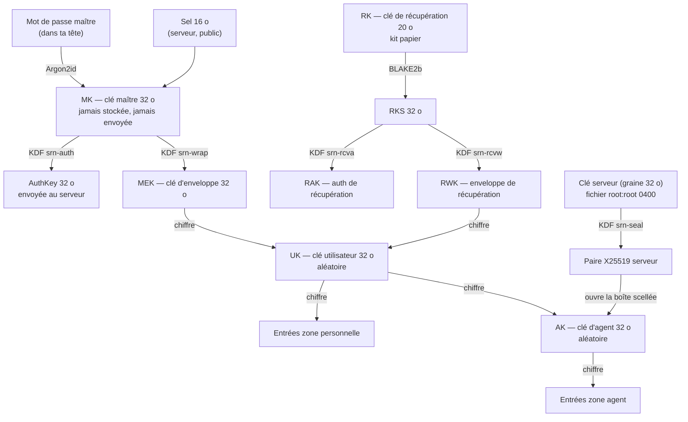

# Spécification cryptographique — Serenity v1

> **Statut : proposée, en attente de validation.** Aucune ligne de code crypto n'est écrite
> avant ta validation. Toute modification ultérieure de ce document demande un nouvel accord
> (règle 10 de `CLAUDE.md`).

Ce document décrit **exactement** comment Serenity chiffre ton coffre : quelles clés existent,
d'où elles viennent, ce qui est envoyé au serveur, et ce qui se passe si quelque chose fuit.
Les implémentations Python (serveur) et TypeScript (navigateur) doivent le suivre à l'octet près ;
les vecteurs de test de `shared/test-vectors/` le vérifient.

---

## 1. Principes

1. **Une seule bibliothèque : libsodium.** Navigateur : `libsodium-wrappers-sumo`.
   Serveur : `PyNaCl` (qui embarque libsodium). Aucune primitive écrite à la main.
2. **Deux zones.** La zone **personnelle** n'est lisible que par tes appareils déverrouillés.
   La zone **agent** est lisible par tes appareils **et** par le processus agent du serveur.
3. **Le serveur ne reçoit jamais** : ton mot de passe maître, la clé maître (MK), la clé
   utilisateur (UK), ta clé de récupération, ni une entrée personnelle en clair.
4. **Tout bloc chiffré est lié à son contexte** (utilisateur, entrée, zone, révision) par les
   données associées de l'AEAD : un bloc déplacé, échangé ou rejoué ne se déchiffre pas.
5. **Versionné** : chaque bloc commence par un numéro de version, pour pouvoir faire évoluer
   les algorithmes sans casser les anciens coffres.

## 2. Primitives utilisées

| Usage | Primitive libsodium | Fonction |
|---|---|---|
| Mot de passe maître → clé | Argon2id v1.3 | `crypto_pwhash` (`ALG_ARGON2ID13`) |
| Sous-clés | BLAKE2b (KDF) | `crypto_kdf_derive_from_key` |
| Empreinte | BLAKE2b-256 | `crypto_generichash` |
| Chiffrement authentifié | XChaCha20-Poly1305 (IETF) | `crypto_aead_xchacha20poly1305_ietf_*` |
| Envoi d'une clé au serveur | Boîte scellée X25519 + XSalsa20-Poly1305 | `crypto_box_seal` / `crypto_box_seal_open` |
| Paire de clés serveur | X25519 depuis une graine | `crypto_box_seed_keypair` |
| Bourrage | ISO/IEC 7816-4 | `sodium_pad` / `sodium_unpad` |
| Hachage de la clé d'auth (serveur) | Argon2id | `crypto_pwhash_str` |
| Aléa | CSPRNG du système | `randombytes_buf` |
| Effacement mémoire | — | `memzero` (navigateur), best effort |

**Note PyNaCl** : PyNaCl n'expose pas `crypto_kdf_derive_from_key`. On l'obtient par
`crypto_generichash_blake2b_salt_personal`, exactement comme libsodium le construit en interne :
clé = clé mère, sel = identifiant de sous-clé (8 octets little-endian) + 8 octets nuls,
personnalisation = contexte (8 octets) + 8 octets nuls, message vide.
Vérifié : sorties identiques octet pour octet à libsodium.js 1.0.22 (voir §10).

## 3. Hiérarchie des clés



| Clé | Taille | Origine | Où elle vit | Le serveur la voit ? |
|---|---|---|---|---|
| Mot de passe maître | — | Toi | Ta tête | Jamais |
| **MK** | 32 o | Argon2id(mot de passe, sel) | Mémoire du client, quelques ms | Jamais |
| **AuthKey** | 32 o | KDF(MK, 1, `srn-auth`) | Envoyée à la connexion | Oui, stockée **hachée** (Argon2id) |
| **MEK** | 32 o | KDF(MK, 1, `srn-wrap`) | Mémoire du client, quelques ms | Jamais |
| **UK** | 32 o | Aléa, créée à l'inscription | Mémoire du client tant qu'il est déverrouillé | Jamais (seulement chiffrée) |
| **RK** | 20 o (160 bits) | Aléa, créée à l'inscription | Kit papier | Jamais |
| **RAK** | 32 o | KDF(RKS, 1, `srn-rcva`) | Envoyée lors d'une récupération | Oui, stockée **hachée** |
| **RWK** | 32 o | KDF(RKS, 1, `srn-rcvw`) | Mémoire du client pendant la récupération | Jamais |
| **AK** | 32 o | Aléa, créée à l'inscription | Mémoire du client ; processus agent | Oui, **dans le processus agent uniquement** |
| **Clé serveur (SK)** | graine 32 o | Aléa, créée au 1er démarrage | Fichier `root:root 0400`, hors base | — |
| **Clé TOTP serveur** | 32 o | Aléa, créée au 1er démarrage | Fichier séparé, lu par l'api | — |

Pourquoi MEK plutôt que MK directement pour chiffrer UK : MK ne sert **qu'à** dériver des
sous-clés. AuthKey (envoyée) et MEK (gardée) sont indépendantes : connaître AuthKey ne révèle
rien sur MEK.

Pourquoi deux fichiers serveur : la clé serveur (qui ouvre la zone agent) n'est montée **que
dans le processus agent**. L'api, exposée au réseau, n'en a pas besoin ; elle ne détient que la
clé TOTP, qui protège les secrets de double authentification en base.

## 4. Argon2id : paramètres retenus

| Paramètre | Valeur | Constante libsodium |
|---|---|---|
| Algorithme | Argon2id v1.3 | `crypto_pwhash_ALG_ARGON2ID13` |
| Mémoire | **64 Mio** (67 108 864 o) | `memlimit` |
| Itérations | **3** | `opslimit` |
| Parallélisme | 1 (imposé par libsodium) | — |
| Sel | 16 o aléatoires, par utilisateur | `crypto_pwhash_SALTBYTES` |
| Sortie | 32 o | — |

**Justification (navigateur mobile)** :

- libsodium.js tourne en WebAssembly, sur **un seul cœur**. Mesure sur la VM (Ryzen 9 3900XT,
  Node 22) : 33 ms pour 19 Mio / 2 passes, **126 ms pour 64 Mio / 3 passes**, 252 ms pour
  128 Mio. Un téléphone milieu de gamme est 5 à 10 fois plus lent : **≈ 0,6 à 1,3 s** à chaque
  déverrouillage, acceptable.
- 64 Mio reste sous les limites mémoire WebAssembly des navigateurs mobiles (Safari iOS
  compris) ; 128 Mio et plus risquent un plantage de l'onglet sur les vieux appareils.
- C'est au-dessus des recommandations OWASP (19 Mio / 2 passes minimum) et équivalent au
  réglage par défaut de Bitwarden (64 Mio / 3 passes).
- **Plancher imposé par le client** : il refuse tout paramètre inférieur à 64 Mio / 3 passes
  renvoyé par le serveur. Un serveur malveillant ne peut donc pas affaiblir la dérivation.
- Les paramètres sont stockés par utilisateur : on pourra les augmenter plus tard (au prochain
  changement de mot de passe maître).

**Normalisation** : le mot de passe est normalisé en **Unicode NFKC** puis encodé en UTF-8,
pour qu'un « é » tapé sur Android et sur un PC donne les mêmes octets.
Longueur : 12 caractères minimum (après normalisation), 1024 octets maximum.

## 5. Formats sérialisés

### 5.1 Conventions

- Octets dans le JSON : **base64url sans bourrage** (RFC 4648 §5).
- Identifiants : UUID v4 en minuscules, forme canonique à tirets (`0f0c7a9e-…`).
- Chaînes de contexte : ASCII, champs séparés par `/`. Aucun champ ne peut contenir `/`
  (UUID, zones et entiers décimaux seulement), donc pas d'ambiguïté.
- Dates : ISO 8601 en UTC, précision milliseconde, suffixe `Z`.

### 5.2 Bloc chiffré (AEAD) — `type 0x01`

| Décalage | Taille | Champ | Valeur |
|---|---|---|---|
| 0 | 1 | version | `0x01` |
| 1 | 1 | type | `0x01` = XChaCha20-Poly1305-IETF |
| 2 | 24 | nonce | aléatoire (`randombytes_buf(24)`) |
| 26 | *n* + 16 | texte chiffré + étiquette | sortie de `crypto_aead_xchacha20poly1305_ietf_encrypt` |

**Données associées** = `bloc[0:2]` (version et type) ‖ UTF-8(contexte).
Le contexte n'est **pas** stocké dans le bloc : le lecteur le reconstruit à partir de ce qu'il
attend (utilisateur, entrée, zone, révision). S'il ne correspond pas, le déchiffrement échoue.

Taille minimale d'un bloc valide : 42 octets. Un bloc de version ou de type inconnu est refusé.

### 5.3 Bloc scellé pour le serveur — `type 0x02`

Sert uniquement à transmettre AK au processus agent, sans que l'api ne la voie jamais en clair.

| Décalage | Taille | Champ | Valeur |
|---|---|---|---|
| 0 | 1 | version | `0x01` |
| 1 | 1 | type | `0x02` = boîte scellée X25519 |
| 2 | 4 | identifiant de clé serveur | `BLAKE2b-256(clé publique serveur)[0:4]` |
| 6 | 48 + *n* | boîte scellée | `crypto_box_seal(message, clé publique serveur)` |

Une boîte scellée n'a pas de données associées ; le lien au contexte est donc **dans le
message** : `message = AK (32 o) ‖ UTF-8(contexte)`. À l'ouverture, le processus agent vérifie
que le contexte correspond exactement à celui attendu, sinon il rejette.

### 5.4 Contextes

| Usage | Contexte |
|---|---|
| UK chiffrée par MEK | `serenity/v1/uk-by-mk/<user_id>` |
| UK chiffrée par RWK | `serenity/v1/uk-by-rk/<user_id>` |
| AK chiffrée par UK | `serenity/v1/ak-by-uk/<user_id>/<ak_version>` |
| AK scellée pour le serveur | `serenity/v1/ak-by-sk/<user_id>/<ak_version>` |
| Entrée | `serenity/v1/item/<user_id>/<item_id>/<zone>/<revision>` |
| Secret TOTP de connexion (serveur) | `serenity/v1/totp/<user_id>` |
| Export chiffré | `serenity/v1/export/<user_id>/<export_id>` |

`<zone>` vaut `personal` ou `agent`. `<revision>` et `<ak_version>` sont des entiers ≥ 1.

Par rapport à `CLAUDE.md` (identifiant + zone + révision), on ajoute l'**identifiant
utilisateur** : un bloc ne peut pas non plus passer d'un compte à un autre.

### 5.5 Sous-clés (KDF)

`KDF(clé, id, contexte)` = `crypto_kdf_derive_from_key(32, id, contexte, clé)`, contexte de
**8 caractères exactement** :

| Sous-clé | Clé mère | id | Contexte |
|---|---|---|---|
| AuthKey | MK | 1 | `srn-auth` |
| MEK | MK | 1 | `srn-wrap` |
| RAK | RKS | 1 | `srn-rcva` |
| RWK | RKS | 1 | `srn-rcvw` |
| Somme de contrôle du kit | RKS | 1 | `srn-rcvc` |
| Graine X25519 serveur | SK | 1 | `srn-seal` |
| Clé d'export | clé Argon2id d'export | 1 | `srn-expt` |

### 5.6 Kit de récupération

- RK = 20 octets aléatoires (160 bits).
- RKS = `crypto_generichash(32, RK)` (BLAKE2b-256 sans clé), puis les sous-clés du §5.5.
- **Affichage** : RK en base32 **Crockford** (alphabet `0123456789ABCDEFGHJKMNPQRSTVWXYZ`),
  32 caractères en 8 groupes de 4, suivis d'un 9ᵉ groupe de contrôle = les 20 premiers bits de
  KDF(RKS, 1, `srn-rcvc`) en base32 Crockford.
  Exemple de forme : `K7QM-2XDA-9PLE-R4TN-VB8W-Z3HC-6JYF-S5GU-4MQA`.
- **Saisie** : casse ignorée, tirets et espaces ignorés, `I`/`L` lus `1`, `O` lu `0`.
  Un groupe de contrôle faux signale une faute de frappe avant tout appel au serveur.

### 5.7 Entrée déchiffrée

Le texte clair d'une entrée est un objet JSON UTF-8, **bourré** avec `sodium_pad` à un multiple
de **256 octets** avant chiffrement (pour ne pas révéler la longueur d'un mot de passe) :

```json
{
  "v": 1,
  "type": "login",
  "name": "Netflix",
  "username": "tristan@exemple.fr",
  "password": "…",
  "urls": ["https://www.netflix.com/login"],
  "notes": "",
  "totp": "otpauth://totp/Netflix:tristan?secret=…&issuer=Netflix",
  "fields": [{ "name": "Code PIN", "value": "…", "hidden": true }],
  "passwordChangedAt": "2026-09-01T10:00:00.000Z",
  "favorite": false
}
```

| Champ | Type | Obligatoire | Remarque |
|---|---|---|---|
| `v` | entier | oui | version du format, `1` |
| `type` | `"login"` \| `"note"` | oui | `note` = note sécurisée sans identifiant |
| `name` | chaîne | oui | 1 à 200 caractères |
| `username`, `password`, `notes` | chaîne | non | vide par défaut |
| `urls` | liste de chaînes | non | la première sert au domaine affiché |
| `totp` | chaîne | non | URI `otpauth://` ou clé base32 seule |
| `fields` | liste | non | champs personnalisés, `hidden` masque la valeur |
| `passwordChangedAt` | date | non | sert aux alertes « mot de passe ancien » |
| `favorite` | booléen | non | |

Un lecteur **ignore** les champs inconnus (compatibilité ascendante) et refuse un `v`
supérieur à celui qu'il connaît. Le nom de l'entrée est **chiffré** : pour la zone personnelle,
le serveur ne connaît même pas le nom des sites.

## 6. Ce que stocke le serveur

| Donnée | Forme | Lisible par le serveur ? |
|---|---|---|
| Identifiant de connexion, `user_id` | clair | oui |
| Sel, paramètres Argon2id | clair | oui (publics par nature) |
| Hachage Argon2id d'AuthKey | `crypto_pwhash_str` (64 Mio, 3 passes) | non réversible |
| Hachage Argon2id de RAK | idem | non réversible |
| UK chiffrée par MEK, UK chiffrée par RWK | blocs `0x01` | **non** |
| AK chiffrée par UK | bloc `0x01` | **non** |
| AK scellée | bloc `0x02` | **oui, processus agent seulement** |
| Secret TOTP de connexion | bloc `0x01` (clé TOTP serveur) | oui, api seulement |
| Entrées zone personnelle | blocs `0x01` (UK) | **non** |
| Entrées zone agent | blocs `0x01` (AK) | oui, processus agent seulement |
| Zone, révision, dates, corbeille, politiques de rotation | clair | oui |

Métadonnées visibles : nombre d'entrées, taille approximative (au multiple de 256 o près),
dates de modification, zone de chaque entrée, entrées déléguées.

## 7. Flux

Notations : ▶ côté client (navigateur), ◆ côté serveur. Les clés intermédiaires (MK, MEK,
AuthKey, RWK) sont effacées de la mémoire dès qu'elles ne servent plus.

### 7.1 Création de compte

1. ▶ Tu choisis un identifiant et un mot de passe maître (≥ 12 caractères, jauge de robustesse).
2. ▶ Génère : `user_id` (UUID v4), sel (16 o), UK, AK, RK. `ak_version = 1`.
3. ▶ Dérive MK (Argon2id), puis AuthKey et MEK ; RKS, puis RAK et RWK.
4. ▶ Chiffre : `UK_par_MEK`, `UK_par_RWK`, `AK_par_UK`.
5. ▶ Récupère la clé publique du serveur (`GET /api/crypto/server-key` : clé + identifiant),
   et scelle `AK_scellée` pour elle.
6. ▶ → ◆ Envoie : identifiant, `user_id`, sel, paramètres, AuthKey, RAK, et les quatre blocs.
7. ◆ Vérifie les formats et le plancher des paramètres, hache AuthKey et RAK, crée le compte
   **en attente**, génère le secret TOTP et le renvoie **une seule fois** (QR code).
8. ▶ Tu scannes le QR code et tapes un code : ◆ l'active. Le secret TOTP est stocké chiffré.
9. ▶ Affiche le **kit de récupération** (RK formatée). Tu confirmes l'avoir noté ; RK est
   effacée de la mémoire.

Le serveur n'a reçu que AuthKey, RAK et des blocs chiffrés.

### 7.2 Connexion

1. ▶ → ◆ `POST /api/auth/prelogin {identifiant}` → sel et paramètres. Pour un identifiant
   inconnu, le serveur renvoie un **faux sel stable** (BLAKE2b de l'identifiant avec une clé
   serveur) : on ne peut pas deviner quels comptes existent.
2. ▶ Vérifie le plancher des paramètres, dérive MK → AuthKey et MEK.
3. ▶ → ◆ `POST /api/auth/login {identifiant, AuthKey, code TOTP}`.
4. ◆ Vérifie le hachage **et** le TOTP (anti-rejeu, limitation des tentatives). Ouvre une
   **session d'appareil de 60 jours** (cookie `HttpOnly`, `Secure`, `SameSite=Strict`), déjà
   **déverrouillée** (§7.3), et renvoie `UK_par_MEK`, `AK_par_UK`, `ak_version`.
5. ▶ Déchiffre UK avec MEK, puis AK avec UK. Un échec ici signale un bloc modifié : on arrête
   et on prévient. MK, MEK et AuthKey sont effacées ; UK et AK restent **en mémoire**.

### 7.3 Sessions d'appareil et déverrouillage

**Deux niveaux**, pour que l'usage quotidien reste simple :

| Niveau | Durée | Comment on l'obtient | Ce qu'il permet |
|---|---|---|---|
| **Session d'appareil** | **60 jours**, fixes (pas prolongés à l'usage) | Connexion complète : mot de passe maître **+ TOTP** (§7.2) | Lire les blocs chiffrés, les notifications |
| **Déverrouillage** | 15 min, prolongé à chaque action | Mot de passe maître seul (AuthKey) | Tout le reste : créer, modifier, supprimer, déléguer, reprendre, approuver ou refuser une rotation, kill switch, export, réglages |

Donc : le TOTP n'est demandé que sur un **nouvel appareil**, puis **tous les 60 jours** par
appareil. Au quotidien, seul le mot de passe maître est demandé.

**Déverrouiller** (session d'appareil valide, coffre verrouillé après 15 min d'inactivité ou
fermeture de l'onglet) :

1. ▶ Tu retapes ton mot de passe maître. Le sel, les paramètres et `UK_par_MEK` sont en cache
   local (ce sont des données publiques ou chiffrées).
2. ▶ Dérive MK → MEK et AuthKey, déchiffre UK puis AK.
3. ▶ → ◆ `POST /api/auth/unlock {AuthKey}` : le serveur vérifie et marque la session
   **déverrouillée** pour 15 min glissantes. Limitation des tentatives comme à la connexion.
4. Hors ligne, les étapes 1 et 2 suffisent pour **lire** le coffre ; les modifications
   attendent le retour du réseau.

Au verrouillage, le client efface UK et AK, et prévient le serveur (`POST /api/auth/lock`) :
la session repasse au niveau « appareil ». Un cookie volé ne permet donc aucune action
sensible sans le mot de passe maître.

Chaque session d'appareil est listée dans les réglages (appareil, date de connexion,
dernière activité) et peut être **révoquée** à distance. Changer le mot de passe maître ou
utiliser le kit de récupération révoque toutes les sessions.

**Plus tard** : déverrouillage par **empreinte digitale**, sur Android (V2, clé protégée par le
Keystore) et sur le web via une passkey dotée de l'extension WebAuthn PRF, quand le navigateur
le permet. La passkey remplace alors la saisie du mot de passe maître pour obtenir MEK ; ce
mécanisme fera l'objet d'une mise à jour de cette spécification.

### 7.4 Ajout et modification d'une entrée

1. ▶ Nouvelle entrée : `item_id` = UUID v4, `zone = personal`, `revision = 1`.
2. ▶ `bloc = AEAD(UK, sodium_pad(JSON, 256), contexte item/…/personal/1)`.
3. ▶ → ◆ Envoie `item_id`, zone, révision, bloc.
4. Modification : révision `r` → `r + 1`, nouveau nonce, nouveau contexte. Le serveur refuse
   (`409`) si la révision attendue n'est plus la bonne (modifié ailleurs entre-temps).

### 7.5 Délégation (personnelle → agent)

1. ▶ Tu confirmes (« L'agent pourra lire et changer ce mot de passe »).
2. ▶ Déchiffre avec UK (contexte `personal/r`), rechiffre avec AK (contexte `agent/r+1`).
3. ▶ → ◆ Envoie le nouveau bloc, zone `agent`, révision `r + 1`. ◆ Journalise.
4. L'historique des révisions précédentes reste chiffré par UK : le serveur ne le lit pas.

### 7.6 Reprise (agent → personnelle)

1. ▶ Tu confirmes. Déchiffre avec AK (`agent/r`), rechiffre avec UK (`personal/r+1`).
2. ▶ → ◆ Envoie. ◆ Journalise et **supprime les révisions « agent »** de l'historique de
   cette entrée.
3. ▶ L'appli recommande de **changer ce mot de passe** : le serveur l'a connu.

### 7.7 Changement du mot de passe maître

1. ▶ (Coffre déverrouillé, UK en mémoire.) Tu tapes l'ancien et le nouveau mot de passe.
2. ▶ Dérive l'ancienne AuthKey ; nouveau sel ; nouvelle MK → nouvelle AuthKey et nouvelle MEK.
3. ▶ Rechiffre UK : `UK_par_MEK'`. **Les entrées ne changent pas** (UK est la même).
4. ▶ → ◆ Envoie ancienne AuthKey, code TOTP, nouveau sel, paramètres, nouvelle AuthKey,
   `UK_par_MEK'`. ◆ Vérifie, remplace, **ferme toutes les autres sessions**, journalise.

### 7.8 Récupération par le kit

1. ▶ Tu saisis ton identifiant, ta clé de récupération (le groupe de contrôle détecte une faute
   de frappe) et un code TOTP.
2. ▶ Dérive RKS → RAK et RWK. ▶ → ◆ Envoie identifiant, RAK, code TOTP.
3. ◆ Vérifie, renvoie `UK_par_RWK` (et `AK_par_UK`).
4. ▶ Déchiffre UK. Tu choisis un **nouveau mot de passe maître** : suite identique à 7.7
   (sans l'ancienne AuthKey, remplacée par RAK).
5. ▶ Génère un **nouveau kit** (nouvelle RK, `UK_par_RWK'`, nouvelle RAK) et l'affiche :
   l'ancien kit, tapé sur un appareil, ne vaut plus rien. ◆ Ferme toutes les sessions.

TOTP perdu **et** mot de passe oublié : la récupération demande aussi le TOTP. La réinitialisation
du TOTP se fait par une commande d'administration sur la VM (accès root), qui ne donne aucun
accès à la zone personnelle.

### 7.9 Rotation de la clé d'agent (AK)

À faire après une reprise massive, ou si tu soupçonnes une fuite de la zone agent.

1. ▶ (Déverrouillé.) Génère AK', `ak_version + 1`.
2. ▶ Pour chaque entrée agent : déchiffre avec AK, rechiffre avec AK' (révision + 1).
3. ▶ Chiffre `AK'_par_UK`, scelle `AK'_scellée`.
4. ▶ → ◆ Envoie le tout en **une seule transaction** : soit tout est remplacé, soit rien.

Rotation de la **clé serveur** (autre cas) : le serveur ouvre chaque `AK_scellée` avec
l'ancienne clé et la rescelle pour la nouvelle, sans intervention du client.

### 7.10 Export chiffré

1. ▶ Tu choisis une phrase de passe d'export. Nouveau sel, Argon2id (mêmes paramètres),
   KDF `srn-expt`.
2. ▶ Fichier JSON : `{format, version, kdf: {sel, paramètres}, export_id, bloc}` où le bloc
   chiffre la liste des entrées déchiffrées (les deux zones), contexte `export/…`.
3. Le fichier est produit **dans le navigateur** et ne transite pas par le serveur.

## 8. Modèle de menace

### 8.1 Fuite de la base seule (copie de `serenity.sqlite`, sauvegarde volée…)

- **Zone personnelle** : protégée. L'attaquant doit deviner ton mot de passe maître, et chaque
  essai coûte un Argon2id à 64 Mio. Un mot de passe maître **fort** (phrase de 4 à 5 mots
  aléatoires, ou 14+ caractères variés) rend l'attaque irréaliste ; un mot de passe faible,
  non.
- **Zone agent** : protégée, tant que la clé serveur n'a pas fui avec la base. C'est pourquoi
  elle est hors de la base et **sauvegardée séparément**.
- **Secrets TOTP** : chiffrés par la clé TOTP serveur, hors de la base.
- **Métadonnées** : visibles (voir §6).

### 8.2 Fuite de la clé serveur seule

Sans la base, elle n'ouvre rien. Avec la base : la **zone agent** est exposée. Parade : rotation
de la clé serveur, puis rotation d'AK (§7.9) et changement des mots de passe de la zone agent.

### 8.3 VM compromise (attaquant root, en direct)

- La **zone agent** est exposée (le processus agent détient AK). C'est le prix de l'autonomie.
- Les secrets TOTP de connexion sont exposés.
- **La zone personnelle n'est pas lue immédiatement**, mais l'attaquant peut **modifier l'appli
  web** servie par la VM pour capturer ton mot de passe maître à la prochaine saisie. À partir
  de là, la zone personnelle tombe aussi. C'est la limite de tout coffre servi par le web.
  Parades partielles : accès limité au tailnet, CSP stricte, et en V2 l'**appli Android**, dont
  le code est installé sur le téléphone et ne vient pas de la VM à chaque ouverture.
- L'attaquant peut aussi supprimer, bloquer ou **revenir en arrière** sur des entrées (§8.5).

### 8.4 Navigateur ou appareil compromis

Un logiciel malveillant, une extension trop curieuse ou un accès physique à l'appareil
déverrouillé voit tout ce que tu vois : UK et AK sont en mémoire, les mots de passe s'affichent.
Serenity ne peut rien contre ça. Conseil : un profil de navigateur dédié, sans extensions.

### 8.5 Serveur malveillant (actif) ou réseau hostile

- **Ne peut pas** : lire la zone personnelle, forger ou modifier une entrée (AEAD), déplacer un
  bloc vers une autre entrée, zone ou compte (données associées), affaiblir Argon2id (plancher
  côté client), fabriquer une fausse AK acceptée par le client (il faudrait UK).
- Un **cookie de session volé** donne seulement accès aux blocs chiffrés : toute action
  sensible exige un déverrouillage récent (AuthKey, donc le mot de passe maître).
- **Peut** : refuser le service, supprimer des entrées, servir une **ancienne version** complète
  d'une entrée avec son ancienne révision (retour arrière). Le client mémorise la plus haute
  révision vue par entrée et alerte s'il reçoit moins, mais un appareil neuf ne peut pas le
  détecter.
- Le réseau est protégé par Tailscale (WireGuard) puis HTTPS.

### 8.6 Perte

- Mot de passe maître oublié : **kit de récupération** + TOTP.
- Mot de passe **et** kit perdus : la zone personnelle est **perdue définitivement**. C'est
  voulu : personne, pas même l'administrateur de la VM, ne peut l'ouvrir.
- Clé serveur perdue (sans sauvegarde) : la zone agent n'est plus lisible **par le serveur**,
  mais toujours par tes appareils (AK chiffrée par UK). Il suffit de reprendre les entrées
  ou de refaire une AK.

## 9. Ce que Serenity ne protège pas

Dit clairement :

1. **Un appareil ou un navigateur compromis** pendant qu'il est déverrouillé. Pendant les
   60 jours d'une session d'appareil, quelqu'un qui connaît ton mot de passe maître **et** a
   accès à l'appareil n'a pas besoin du TOTP.
2. **Une VM compromise sur la durée** : zone agent immédiatement, zone personnelle dès ta
   prochaine saisie du mot de passe maître dans l'appli web servie par cette VM.
3. **Un mot de passe maître faible** face à une fuite de la base.
4. **Les métadonnées** : nombre d'entrées, tailles approximatives, dates, zones.
5. **Le retour arrière** d'une entrée par un serveur malveillant, sur un appareil neuf.
6. **L'effacement parfait de la mémoire** : JavaScript copie les chaînes de caractères
   (mots de passe affichés, JSON déchiffré) sans qu'on puisse les effacer. On efface les clés
   (tableaux d'octets) au verrouillage ; le reste disparaît quand le navigateur le décide.
7. **Le presse-papiers** : un mot de passe copié est lisible par les autres applis pendant
   les 30 s avant effacement.
8. **Le hameçonnage** : sans extension (V1), Serenity ne vérifie pas le site où tu colles
   un mot de passe.
9. **Les mots de passe de la zone agent face au serveur** : par définition, il les lit.
10. **Un audit** : cette conception n'a pas été relue par un expert externe. À faire avant
    d'y mettre des comptes réels (phase 8).

## 10. Implémentation et vecteurs de test

### 10.1 Modules

Même interface des deux côtés, noms adaptés à chaque langage :

| Fonction | Python (`api/serenity/crypto/`) | TypeScript (`web/src/crypto/`) |
|---|---|---|
| Normaliser et dériver MK | `derive_master_key` | `deriveMasterKey` |
| Sous-clés | `derive_subkey` | `deriveSubkey` |
| Bloc AEAD | `encrypt_block`, `decrypt_block` | `encryptBlock`, `decryptBlock` |
| Contextes | `context_*` | `context*` |
| Boîte scellée | `seal_for_server`, `open_sealed` | `sealForServer`, `openSealed` |
| Kit de récupération | `encode_recovery_key`, `decode_recovery_key`, `derive_recovery_keys` | idem en camelCase |
| Entrée | `encrypt_item`, `decrypt_item` | `encryptItem`, `decryptItem` |
| Clé serveur | `load_server_key`, `server_public_key` | — |

Les fonctions de chiffrement acceptent un nonce **uniquement dans les tests** (paramètre
réservé), pour produire des vecteurs déterministes ; en production le nonce est toujours
tiré au hasard.

### 10.2 Vecteurs partagés (`shared/test-vectors/`)

Fichiers JSON, versionnés avec le code :

| Fichier | Contenu |
|---|---|
| `argon2id.json` | mot de passe (dont Unicode à normaliser), sel, paramètres → MK |
| `kdf.json` | clé mère, id, contexte → sous-clé |
| `aead.json` | clé, nonce, contexte, clair → bloc (et cas qui doivent échouer : contexte faux, octet modifié, version inconnue) |
| `recovery.json` | RK → texte affiché, RKS, RAK, RWK ; saisies tolérées et erronées |
| `item.json` | UK, contexte, JSON d'entrée, nonce → bloc bourré |
| `sealed.json` | graine serveur → clé publique, identifiant ; blocs scellés à ouvrir |

### 10.3 Vérification croisée en CI

1. Python et TypeScript vérifient chacun **tous** les vecteurs statiques.
2. **Dans les deux sens** : un job fait chiffrer par Python des blocs neufs (nonce aléatoire,
   boîtes scellées) que TypeScript déchiffre, puis l'inverse.
3. Le job échoue au moindre octet de différence.

## 11. Évolutions prévues

- Paramètres Argon2id plus élevés quand les appareils le permettront (par utilisateur).
- Rotation de UK (rechiffrement de toute la zone personnelle) : hors V1.
- Appli Android (V2) : même spécification, via un binding libsodium, validée par les mêmes
  vecteurs.
